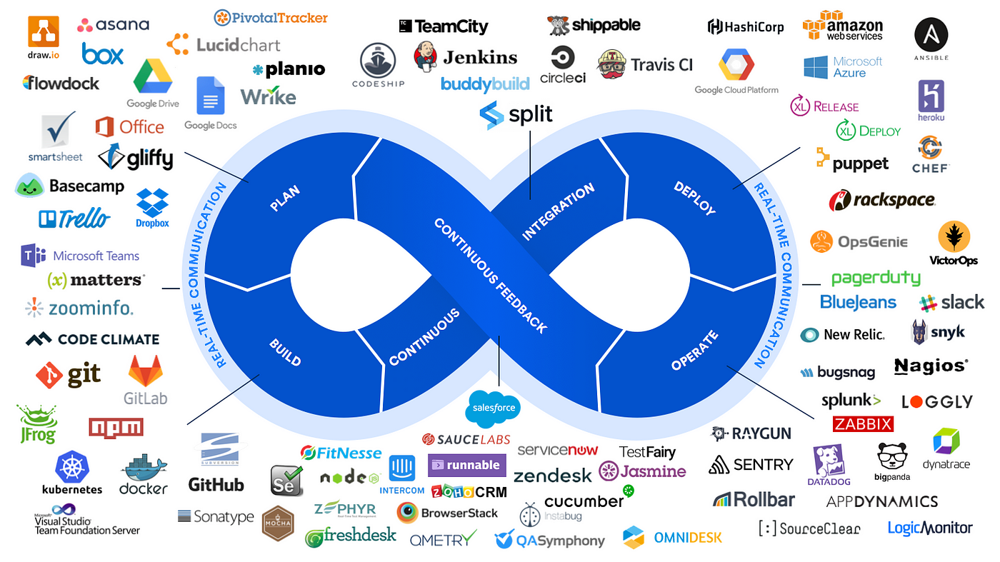

# Integrated IT Management Infrastructure and DevOps

DevOps is a dynamic and transformative approach that revolutionizes how software development and IT operations collaborate and deliver value to businesses. Picture this: you're on a journey where every step, from code inception to deployment and beyond, is a seamlessly integrated process. DevOps isn't just about tools or methodologies; it's a cultural shift, fostering collaboration, automation, and continuous improvement. As an IT Consultant, Instructor, and Senior Software Architect with expertise in Model Driven Engineering and Microservice Architecture, you're already well-versed in the intricacies of software development. Now, let's embark on a voyage where you'll harness the power of DevOps to streamline workflows, boost efficiency, and ultimately, drive innovation. Throughout this course, we'll delve into the core principles of DevOps, explore essential tools and practices, and equip you with the skills needed to orchestrate a harmonious symphony between development and operations. Are you ready to embark on this transformative journey into the world of DevOps?
## Disclaimer
> Here, you'll find a treasure trove of practical exercises and hands-on activities designed to reinforce your understanding of DevOps principles and practices. However, please note that this repository contains only the labs, and if you're interested in accessing the full course materials, including lectures, slides, and additional resources, please reach out to me directly at m.aitsaid@uhp.ac.ma. I'll be more than happy to assist you in gaining access to the complete course content.

## Table of Contents

### Recap
- System Information
- Networks
- Operating Systems

### Infrastructure
- RAID
- Server Installation 
    - Linux
    - Windows
- Network Installation

### Services
- File Management Services
    - FTP
    - NFS
    - Samba
- DNS
- DHCP
- [Postfix](services/linux/Postfix/README.md)
- Active Directory
- [LDAP](services/linux/LDAP/README.md)

### Databases
- MySQL
- MariaDB
- PostgreSQL
- Oracle Database
- SQL Server
- MongoDB
- Elasticsearch

### Version Control (Git)
- Introduction to Version Control
- Getting Started with Git
- Git Basics
- Working with Remote Repositories
- Collaboration with Git
- Branching Strategies
- Advanced Git Techniques
- Git Tools and Integrations
- Git Workflow Automation
- Git Best Practices

### Web Servers
- [Nginx](deployment/nginx/README.md)
- Apache 

### Deployment
- [Prerequisites](deployment/Prerequisites.md)
- [Static (HTML, CSS, and JS)](deployment/static/html/README.md)
- Static (Webpack)
- Angular
- React
- VueJs
- [Java (Spring)](./deployment/spring/README.md)
- [PHP (Laravel)](./deployment/laravel/README.md)
- [NodeJS (Express)](./deployment/express/README.md)
- [Python (Flask)](./deployment/flask/README.md)

### Virtualization
- VMware Workstation
    - Installation
    - Create a new VM
    - Expand Resource CPU and Memory
    - Expand and Add Disks
    - Networking
    - Snapshot
    - Cloning
- ESXi and vSphere
    - [Installation and Initial Configuration](./virtualization/esxi-vSphere/README.md)
    - Create a new VM
    - Storage
    - Networking
    - Snapshots and Cloning
    - High Availability (HA)
    - Backup and Recovery
    - vMotion
    - Distributed Resource Scheduler (DRS)
    - Fault Tolerance (FT)
    - Performance Monitoring
- vCenter
    - Installation and Initial Configuration
    - Permissions and User Management
    - Resource Management
    - High Availability
    - Monitoring and Alarms
    - Backup and Restore
    - Cloning and Templates
- Automation
    - PowerCLI
    - vRealize Orchestrator
    - Automated Deployment
    - Backup Automation
    - Scheduling and Task Automation
    - Configuration Management
    - Monitoring and Alerts Automation

### Dockerization
- [Installation et Configuration](docker/README.md)
- Application Deployment
    - [Prerequisites](deployment/Prerequisites.md)
    - [Static (HTML, CSS, and JS)](deployment/static/html/README.md)
    - Static (Webpack)
    - Angular
    - React
    - VueJs
    - [Java (Spring)](./deployment/spring/README.md)
    - [PHP (Laravel)](./deployment/laravel/README.md)
    - [NodeJS (Express)](./deployment/express/README.md)
    - [Python (Flask)](./deployment/flask/README.md)

### Automation
- Scripting
- Vagrant
- Terraform
- Puppet
- Chef
- Ansible

### DevOps
- CI/CD (Continuous Integration & Continuous Delivery)
- GitHub Actions
- Jenkins
- GitLab

### Security
- SSL/TLS
- Prowler
- DevSecOps
- Securing Pipelines
- Securing Chains
- ACL

### Monitoring
- Logging
- Prometheus
- Kibana
- Grafana
- ELK Stack

### Kubernetes
- Pods and Deployments
- Services and Networking
- Persistent Storage
- Scaling and Autoscaling
- ConfigMaps and Secrets
- Helm and Package Management
- Monitoring and Logging
- Security Best Practices

### Cloud Computing 
- Introduction to Cloud Services
    - Definition of Cloud Computing
    - Definition of Hosting Services
    - Types of Cloud Services:
        - Infrastructure as a Service (IaaS)
        - Platform as a Service (PaaS)
        - Software as a Service (SaaS)
    - Overview of Popular Cloud Providers
- Understanding Cloud Pricing
    - Factors Affecting Cloud Pricing
    - Pricing Models:
        - Pay-As-You-Go
        - Reserved Instances
        - Spot Instances
    - Estimating Costs: Cloud Pricing Calculators
- Setting Up Virtual Private Servers (VPS)
    - Selecting a Cloud Provider (AWS vs GCP vs Azure)
    - Creating a Virtual Machine Instance
    - Configuring Security Groups and Firewall Rules
    - Connecting to the VPS via SSH
- Deploying Apps using pre-configured services
    - Overview of Application Architecture
    - Setting Up a Server Instance
    - Deploying Application Code
- Configuring Domain Name and DNS
- Managing Storage and Databases
    - Choosing Storage Options: Object Storage vs. Block Storage
    - Creating and Managing Storage Buckets
- Setting Databases
    - MySQL
    - MariaDB
    - PostgreSQL
    - Oracle Database
    - SQL Server
    - MongoDB
    - Elasticsearch
    - Backing Up and Restoring Data
- Implementing Scalability and High Availability
    - Load Balancing Strategies
    - Auto Scaling Groups
    - Implementing Redundancy and Failover
    - Monitoring Performance and Health Checks
- Implementing Security Best Practices
    - Identity and Access Management (IAM)
    - Encryption at Rest and in Transit
    - Network Security: VPCs, Security Groups, and ACLs
    - Compliance and Governance Considerations
- Monitoring and Performance Optimization
    - Monitoring Infrastructure and Application Metrics
    - Setting Up Alerts and Notifications
    - Performance Optimization Techniques
    - Capacity Planning and Resource Optimization
- Advanced Cloud Services
    - Serverless Computing with Functions as a Service (FaaS)
    - Big Data and Analytics Services
    - Machine Learning and Artificial Intelligence Services
    - Internet of Things (IoT) Integration

### Self hosted Services and Microservices
- MinIO
- Keycloak
- Supabase
- Parse Server
- Eureka Server
- Apache Kafka
- RabbitMQ
- Zipkin

### OpenStack
- OpenStack Installation
- OpenStack Horizon Dashboard
- OpenStack CLI Client
- Identity Service (Keystone)
- Image Service (Glance)
- Networking Service (Neutron)
- Compute Service (Nova)
- Block Storage Service (Cinder)
- Object Storage Service (Swift)
- Multi-Node Design & Scaling OpenStack
- Expanding the Cluster

### OpenShift
- Getting Started with OpenShift
- OpenShift Concepts - Projects and Users
- Concepts - Builds and Deployments
- Networks, Services, Routes and Scaling
- Storage, Templates and Catalog

## Compatibility Note

These labs are designed to be compatible with various Linux distributions, including Ubuntu, CentOS, Debian, and others. While the examples and commands provided are based on an Ubuntu server, they can be easily adapted to your specific Linux distribution.

### Package Manager Variations

- For Ubuntu and Debian-based distributions, the package manager used is `apt`. If you're using a different distribution, such as CentOS or Fedora, you can replace the `apt` commands with the appropriate package manager for your distribution (e.g., `yum` or `dnf`).
- Example: Replace `apt install package-name` with `yum install package-name` or `dnf install package-name`.

### Firewall Command Variations

- In this tutorial, the firewall commands are demonstrated using `ufw`, the default firewall configuration tool for Ubuntu. If you're using a different distribution, you can substitute the `ufw` commands with the appropriate firewall management commands for your distribution (e.g., `iptables` or `firewalld`).
- Example: Replace `ufw allow port` with the appropriate command for your firewall management tool.

Please ensure to consult the documentation or resources specific to your Linux distribution for accurate commands and package management guidelines.

## License

## Authors

- [Pr. AIT SAID Mehdi](https://www.linkedin.com/in/mehdi-aitsaid/)
