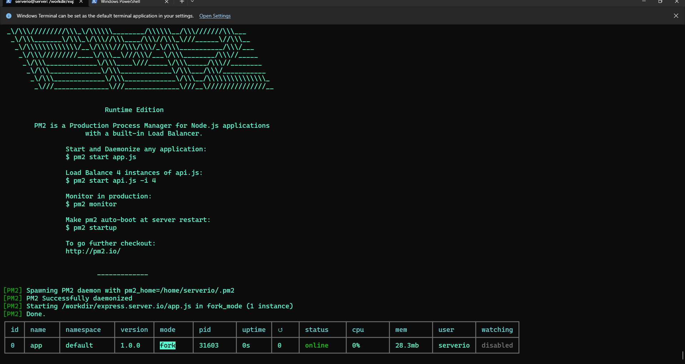
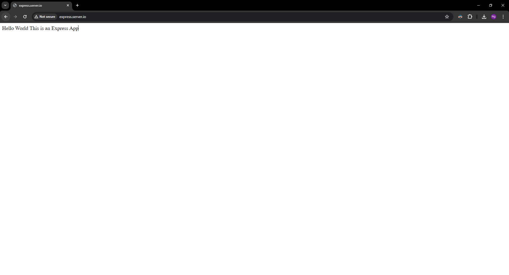

# Deploying a NodeJS/ExpressJS App with Nginx and with/without Docker


Node.js is a powerful, open-source runtime environment that allows developers to execute JavaScript code server-side. It is built on the V8 JavaScript engine, which is also used in Google Chrome, making it highly efficient and fast. Node.js is designed to be lightweight and scalable, leveraging an event-driven, non-blocking I/O model. This makes it particularly well-suited for building real-time applications, such as chat applications, online gaming, and collaborative tools, as well as for handling numerous simultaneous connections.

Express.js is a minimal and flexible web application framework for Node.js that provides a robust set of features for web and mobile applications. It simplifies the development process by offering a comprehensive set of tools and utilities for building server-side applications. Express.js allows developers to set up middleware to respond to HTTP requests, define routes to handle different endpoints, and integrate with various template engines to dynamically render HTML pages. Its simplicity and flexibility make it a popular choice for creating RESTful APIs and single-page applications.

> Note: Before starting this lab, ensure you have completed the following prerequisites:
> - Setting up the client-server environment as described in the [Environment Setup](../../Prerequisites.md) section. Proper DNS configuration and hostname setup are essential for the exercises in this lab.
> - Installing Nginx as outlined in the [Nginx Installation Guide](../../nginx/README.md).
> - Alternatively, if you prefer to use Docker, make sure Docker is installed and running on your server. You can refer to the [Docker Installation Guide](../../../docker/README.md) for detailed instructions.

In this lab, we will learn how to deploy a NodeJS/ExpressJS App  on an Ubuntu server using Nginx. We will cover how to transfer your project to the server using SCP or a GitHub repository.For this lab, we will use the subdomain express.server.io and a demo project named [dome.zip](demo.zip) is attached in the same directory as this lab for your convenience.


## Deploying a Express App Using Nginx without Docker

### Step 1: Create the Website Folder

#### Connect to the Server:

1. Open a terminal on your local machine.

2. Use SSH to connect to your Ubuntu server. Replace <user> and <server-ip> with your server’s username and IP address:

```bash
ssh <user>@<server-ip>
```

Example:

```bash
ssh serverio@192.168.1.10
```
#### Create the Website Folder:
1. Create a new directory for your project:

```bash
sudo mkdir -p /workdir/express.server.io

sudo chown -R $USER:$USER /workdir/express.server.io
sudo chmod -R 755 /workdir/express.server.io

cd /workdir/express.server.io
```

### Step 2: Transfer the Express App Files
You can transfer your eExpress App files to the server using SCP or by cloning a GitHub repository.

#### Using SCP:

1. Open a terminal on your local machine.

2. Use the scp command to transfer the files. Replace <local-path> with the path to your project directory and <user> and <server-ip> with your server's username and IP address:

```bash
scp -r <local-path> <user>@<server-ip>:/workdir/express.server.io
```
Example:

```bash
scp -r ./demo.zip serverio@192.168.1.10:/workdir/express.server.io
```

#### Using GitHub:

1. Navigate to the web root directory:

```bash
cd /workdir/express.server.io
```
2. Clone your repository:
```bash
git clone https://github.com/yourusername/express-website.git express-website
```

### Step 3: Install Node.js

```bash
sudo apt install nodejs
```

Now, Install node package manager

```bash
sudo apt install npm
```

### Step 4: Setup your Express App

```bash
cd /workdir/express.server.io
sudo unzip demo.zip
sudo rm demo.zip
sudo npm i 
```
### Step 5: Leveraging PM2 for Streamlined Node.js Application Management

We will use PM2 to simplify our Node.js application management. PM2 offers automatic restarts for unexpected crashes, graceful reloading for seamless updates, and centralized control over multiple applications. It also provides real-time performance monitoring and centralized logging, making it easier to maintain uptime, identify issues, and ensure a smooth user experience.

```bash
sudo npm install -g pm2
```

Start the above application using pm2:
```bash
pm2 start app.js
```



Check if you application is running or not:
```bash
pm2 status
```
To stop your application you can do:
```bash
pm2 stop <application_name/ID>
```

Your application name for us it is app.js or ID will be 0 as shown above in Output of pm2 status

To restart your application:
```bash
pm2 restart <application_name/ID>
```

After starting your application using pm2; Test your application using CURL if it is running successfully running locally or not
```bash
curl localhost:3000
```


### Step 6: Configure Nginx



1. Create a new Nginx configuration file for your Express App :

```bash
sudo nano /etc/nginx/sites-available/express.server.io
```

2. Add the following configuration to the file:

```nginx
server {
    listen 80;
    server_name express.server.io www.express.server.io;

    location / {
        proxy_pass http://localhost:3000;
        proxy_set_header Host $host;
        proxy_set_header X-Real-IP $remote_addr;
        proxy_set_header X-Forwarded-For $proxy_add_x_forwarded_for;
        proxy_set_header X-Forwarded-Proto $scheme;
    }

    # Define access log and error log locations
    access_log /var/log/nginx/express-app-proxy.access.log;
    error_log /var/log/nginx/express-app-proxy.error.log;
}
```

### Nginx Configuration for Express Boot Application

This Nginx configuration file sets up a server to handle HTTP requests for a express  application hosted under the `express.server.io` domain. The Nginx server acts as a reverse proxy, forwarding incoming requests to the express application running on localhost at port 3000.

**Configuration Breakdown**

- **Server Block:**
    - `listen 80;`
      - The server listens on port 80, which is the default port for HTTP traffic.
    - `server_name express.server.io www.express.server.io;`
      - The server responds to requests for the domain names `express.server.io` and `www.express.server.io`.

- **Location Block:**
    - `location / { ... }`
      - Defines how requests to the root URL and its subpaths should be handled.

- **Proxy Settings:**
    - `proxy_pass http://localhost:3000;`
      - Forwards all incoming requests to the express application running on localhost at port 3000.
    - `proxy_set_header Host $host;`
      - Sets the `Host` header in the forwarded request to the value of the original request's host header.
    - `proxy_set_header X-Real-IP $remote_addr;`
      - Sets the `X-Real-IP` header to the client’s IP address.
    - `proxy_set_header X-Forwarded-For $proxy_add_x_forwarded_for;`
      - Sets the `X-Forwarded-For` header to include the client’s IP address. This header helps in tracking the original client's IP address when requests are forwarded through proxies.
    - `proxy_set_header X-Forwarded-Proto $scheme;`
      - Sets the `X-Forwarded-Proto` header to the scheme (HTTP or HTTPS) used in the original request. This is useful for applications that need to know the protocol used by the client.

- **Log Configuration:**
    - `access_log /var/log/nginx/express-app-proxy.access.log;`
      - Specifies the location of the access log file, which records details about each request handled by the server.
    - `error_log /var/log/nginx/express-app-proxy.error.log;`
      - Specifies the location of the error log file, which records any errors encountered while processing requests.


```bash
sudo ln -s /etc/nginx/sites-available/express.server.io /etc/nginx/sites-enabled/
```

4. Test the Nginx configuration for syntax errors:

```bash
sudo nginx -t
```
5. Reload Nginx to apply the changes:

```bash
sudo systemctl reload nginx
```

### Step 6: Verify the Deployment
Open a web browser on your client machine.
Navigate to http://express.server.io to see your deployed Express App.


## Deploying a Express App Using Nginx with Docker

### Step 1: Make Docker image
1. Inside the working  directory (`/workdir/express.server.io`), create a `Dockerfile` with the following content:


```Dockerfile
# Fetching the minified node image on apline linux
FROM node:slim

# Declaring env
ENV NODE_ENV development

# Setting up the work directory
WORKDIR /express-docker

# Copying all the files in our project
COPY . .

# Installing dependencies
RUN npm install

# Starting our application
CMD [ "node", "app.js" ]

# Exposing server port
EXPOSE 3000
```

2. Delete the node_modules folder

```bash
sudo rm -r node_modules
```


## Step 2: Build and Run the Docker Container

1. Build the Docker image:
```bash
sudo docker build -t express.server.io .
```

2. Run the Docker container:
```bash
sudo docker run -d -p 3000:3000 --name express.server.io-container express.server.io
```
- This command maps port 3000 on your server to port 3000 in the container.

### Step 3: Configure Nginx 

In this case we will use the same configuration for the section without docker

1. Create a new Nginx configuration file for your Express App :

```bash
sudo nano /etc/nginx/sites-available/express.server.io
```

2. Add the following configuration to the file:

```nginx
server {
    listen 80;
    server_name express.server.io www.express.server.io;

    location / {
        proxy_pass http://localhost:3000;
        proxy_set_header Host $host;
        proxy_set_header X-Real-IP $remote_addr;
        proxy_set_header X-Forwarded-For $proxy_add_x_forwarded_for;
        proxy_set_header X-Forwarded-Proto $scheme;
    }

    # Define access log and error log locations
    access_log /var/log/nginx/express-app-proxy.access.log;
    error_log /var/log/nginx/express-app-proxy.error.log;
}
```

```bash
sudo ln -s /etc/nginx/sites-available/express.server.io /etc/nginx/sites-enabled/
```

4. Test the Nginx configuration for syntax errors:

```bash
sudo nginx -t
```
5. Reload Nginx to apply the changes:

```bash
sudo systemctl reload nginx
```

### Step 6: Verify the Deployment
Open a web browser on your client machine.
Navigate to http://express.server.io to see your deployed Express App.