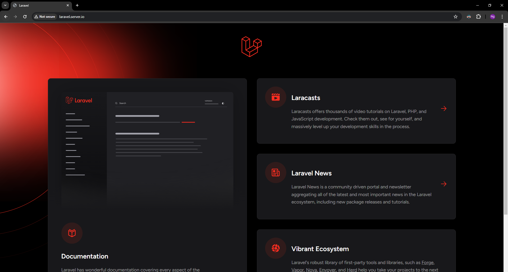
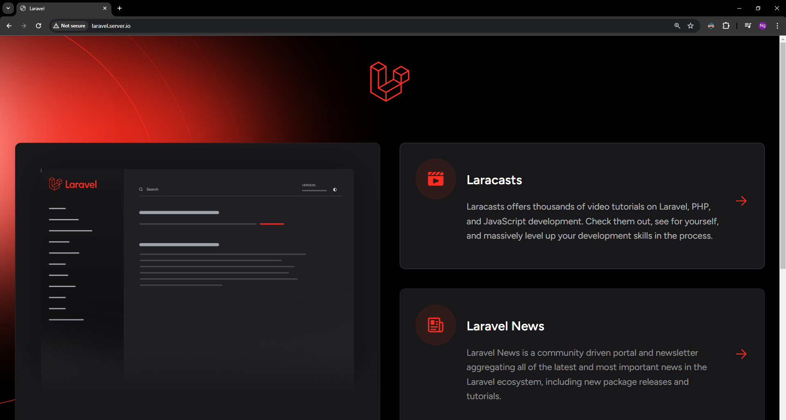

# Deploying a Laravel app with Nginx and with/without Docker


In this lab, we will guide you through the process of deploying a Laravel application using Nginx as the web server. Laravel is a powerful PHP framework designed for web application development, offering a rich set of features and a clean, expressive syntax. Nginx, known for its high performance and low resource usage, is an excellent choice for serving Laravel applications.


> Note: Before starting this lab, ensure you have completed the following prerequisites:
> - Setting up the client-server environment as described in the [Environment Setup](../../Prerequisites.md) section. Proper DNS configuration and hostname setup are essential for the exercises in this lab.
> - Installing Nginx as outlined in the [Nginx Installation Guide](../../nginx/README.md).
> - Alternatively, if you prefer to use Docker, make sure Docker is installed and running on your server. You can refer to the [Docker Installation Guide](../../../docker/README.md) for detailed instructions.


In this lab, we will explore the deployment process of a Laravel application on an Ubuntu server using Nginx with and without Docker. We will guide you through the steps of transferring your Laravel project to the server via SCP or a GitHub repository. For demonstration purposes, we'll utilize the subdomain laravel.server.io. Additionally, we have provided a demo Laravel project named [example-app.zip](example-app.zip) in the same directory as this lab for your convenience. Let's dive in and deploy your Laravel application with Nginx.

## Deploying a Laravel app Using Nginx without Docker

### Step 1: Connect to the Server and Create the Website Folder
#### Connect to the Server:

1. Open a terminal on your local machine.

2. Use SSH to connect to your Ubuntu server. Replace <user> and <server-ip> with your server’s username and IP address:

```bash
ssh <user>@<server-ip>
```

Example:

```bash
ssh serverio@192.168.1.10
```
2. Create the Website Folder:

Once connected to the server, create the directory structure for your laravel website. This structure will include a specific folder for your domain laravel.server.io. Run the following commands:

```bash
sudo mkdir -p /var/www/laravel.server.io
```

3. Set Permissions:

Next, assign ownership of the directory with the $USER environment variable:

```bash
sudo chown -R $USER:$USER /var/www/laravel.server.io
```

The permissions of your web roots should be correct if you haven’t modified your umask value, which sets default file permissions. To ensure that your permissions are correct and allow the owner to read, write, and execute the files while granting only read and execute permissions to groups and others, you can input the following command:

```bash
sudo chmod -R 755 /var/www/laravel.server.io
```


### Step 2: Transfer the Laravel app Files
You can transfer your Laravel app files to the server using SCP or by cloning a GitHub repository.

#### Using SCP:

1. Open a terminal on your local machine.

2. Use the scp command to transfer the files. Replace <local-path> with the path to your project directory and <user> and <server-ip> with your server's username and IP address:

```bash
scp -r <local-path> <user>@<server-ip>:/var/www/html/laravel-site
```
Example:

```bash
scp -r ./example-app.zip serverio@192.168.1.10:/var/www/laravel.server.io
```

3. Connect to server and unzip the project files:

```bash
sudo apt install unzip
cd /var/www/laravel.server.io
unzip example-app.zip
```

### Using GitHub:

1. Navigate to the web root directory:

```bash
cd /var/www/laravel.server.io
```
2. Clone your repository:
```bash
git clone https://github.com/yourusername/laravel-website.git laravel-website
```

### Step 3: Installing PHP 8.3 on Ubuntu

Follow these steps to install PHP 8.3 on your Ubuntu server:

1. Install essential packages:
```bash
sudo apt-get install ca-certificates apt-transport-https software-properties-common
```

2. Add the Ondrej PHP repository:
```bash
sudo add-apt-repository ppa:ondrej/php
```

3. Update the package list:
```bash
sudo apt-get update
```

4. Install PHP 8.3:
```bash
sudo apt-get install php8.3
```

5. Verify PHP version:
```bash
php8.3 --version
```

6. Install PHP-FPM (FastCGI Process Manager):
```bash
sudo apt install php8.3-fpm
```

7. (Optional) Verify PHP-FPM process is running:
```bash
systemctl status php8.3-fpm
```

8. Install common PHP extensions tailored for Laravel:
```bash
sudo apt install openssl php8.3-bcmath php8.3-curl php8.3-mbstring php8.3-mysql php8.3-tokenizer php8.3-xml php8.3-zip php8.3-sqlite3
```

That's it! You now have PHP 8.3 installed on your Ubuntu server. You can proceed to configure your web server (e.g., Nginx or Apache) to work with PHP.

### Step 4: Configure Nginx

1. **Create Nginx Configuration File**: Create a new Nginx configuration file for your Laravel project. You can create a dedicated configuration file for your Laravel application under the `/etc/nginx/sites-available/` directory. For example, create a file named `laravel.server.io`:
```bash
sudo nano /etc/nginx/sites-available/laravel.server.io
```

2. **Configure Nginx**: Configure Nginx to serve your Laravel application. Below is a sample Nginx configuration block:
```nginx
server {
    listen 80;
    server_name laravel.server.io www.laravel.server.io;
    root /var/www/laravel.server.io/example-app/public;

    index index.html index.htm index.php;

    location / {
        try_files $uri $uri/ = 404;
    }

    location ~ \.php$ {
        include snippets/fastcgi-php.conf;
        fastcgi_pass unix:/var/run/php/php8.3-fpm.sock;
     }

    location ~ /\.ht {
        deny all;
    }
}
```

**Explanation of the Nginx Server Configuration**

This Nginx configuration sets up a server to handle HTTP requests for the domain `laravel.server.io` and `www.laravel.server.io`. Let's break down each section:

- **Server Block:**
   - The `server` block defines the configuration for handling requests to your server.

- **Listening Port:**
   - `listen 80;`
   - Specifies that the server will listen on port 80, the default port for HTTP traffic.

- **Server Name:**
   - `server_name laravel.server.io www.laravel.server.io;`
   - Defines the domain names that this server block should respond to. Here, it will respond to requests for `laravel.server.io` and `www.laravel.server.io`.

- **Root Directory:**
   - `root /var/www/laravel.server.io/example-app/public;`
   - Defines the root directory for serving files for this server block. In this case, it's set to the public directory of a Laravel application.

- **Index Files:**
   - `index index.html index.htm index.php;`
   - Specifies the index files to use when a directory is requested. It will first look for `index.html`, then `index.htm`, and finally `index.php`.

- **Location Blocks:**
   - The `location` blocks define how Nginx should handle different types of requests.

- **Default Location Block:**
   - `location / { ... }`
   - Handles requests for the root URL and its subpaths. It uses the `try_files` directive to attempt to serve the requested URI directly. If that fails, it returns a 404 error.

- **PHP Processing Location Block:**
   - `location ~ \.php$ { ... }`
   - Processes PHP files. It includes the `fastcgi-php.conf` file to configure FastCGI processing, then passes PHP requests to the PHP-FPM socket for execution.

- **Deny Access to .ht Files:**
   - `location ~ /\.ht { deny all; }`
   - Denies access to any `.ht` files, which are typically used for Apache configuration and should not be accessible over HTTP.


3. **Enable Nginx Configuration**: Create a symbolic link to enable the Nginx configuration:
```bash
sudo ln -s /etc/nginx/sites-available/laravel.server.io /etc/nginx/sites-enabled/
```

4. **Test Nginx Configuration**: Test the Nginx configuration for syntax errors:
```bash
sudo nginx -t
```

5. **Reload Nginx**: Reload Nginx to apply the changes:
```bash
sudo systemctl reload nginx
```


### Step 5: Set Permissions

1. **Set File Permissions**: Set appropriate permissions for Laravel directories. Laravel requires write access to certain directories. Run the following commands to set permissions:
```bash
cd /var/www/laravel.server.io
sudo chown -R www-data example-app
cd example-app
sudo chown -R www-data:www-data storage bootstrap/cache
sudo chmod -R 775 storage bootstrap/cache
```

### Step 6: Configure Environment Variables (If Required)

1. **Set Environment Variables**: Configure Laravel environment variables. Copy the `.env.example` file to `.env` and update it with your database credentials and other settings:
```bash
cp .env.example .env
```

2. **Generate your application encryption key using**:
```bash
php artisan key:generate
```

### Step 7: Migrate Database (If Required)

1. **Database Migration**: If your Laravel application requires a database, run database migrations to create necessary tables:
```bash
php artisan migrate
```

### Step 6: Verify Deployment

1. **Access Your Laravel Application**: Open a web browser and navigate to your Laravel application's subdomain (e.g., `http://laravel.server.io`). You should see your Laravel application up and running.




## Deploying a Laravel app Using Nginx with Docker


### Step 1: Create a Dockerfile for Your laravel Website

1. Create a new directory for your project:

```bash
sudo mkdir -p /workdir/laravel.server.io

sudo chown -R $USER:$USER /workdir/laravel.server.io
sudo chmod -R 755 /workdir/laravel.server.io

cd /workdir/laravel.server.io
```

2. Add your laravel projet files to this directory using SCP or GitHub as explained in the previous section


3. Inside project directory (example-app), create a `Dockerfile` with the following content:
```Dockerfile
FROM webdevops/php-nginx:8.3-alpine

# Installation in your Image of the minimum required for Docker to function
RUN apk add oniguruma-dev libxml2-dev
RUN docker-php-ext-install \
        bcmath \
        ctype \
        fileinfo \
        mbstring \
        pdo_mysql \
        xml

# Installation of Composer in your image
COPY --from=composer:latest /usr/bin/composer /usr/bin/composer

# Installation of NodeJS if you have compiled assets 
#RUN apk add nodejs npm

ENV WEB_DOCUMENT_ROOT /app/public
ENV APP_ENV production
WORKDIR /app
COPY . .

# Copy the .env.example file and rename it to .env
# You can modify the .env.example file to specify your site's configuration for production
RUN cp -n .env.example .env


# https://laravel.com/docs/10.x/deployment#optimizing-configuration-loading
RUN composer install --no-interaction --optimize-autoloader --no-dev

RUN php artisan key:generate

RUN php artisan config:cache

RUN php artisan route:cache

RUN php artisan view:cache

# If you have compiled assets 
#RUN npm install
#RUN npm run build

RUN chown -R application:application .
```
## Step 2: Build and Run the Docker Container

1. Build the Docker image:
```bash
sudo docker build -t laravel.server.io .
```

2. Run the Docker container:
```bash
sudo docker run -d -p 8888:80 --name laravel.server.io-container laravel.server.io
```
- This command maps port 8888 on your server to port 80 in the container.


### Step 3: Configure Nginx 

In this case we will use the same configuration for the section without docker

1. Create a new Nginx configuration file for your laravel App :

```bash
sudo nano /etc/nginx/sites-available/laravel-proxy
```

2. Add the following configuration to the file:

```nginx
server {
    listen 80;
    server_name laravel.server.io www.laravel.server.io;

    location / {
        proxy_pass http://localhost:8888;
        proxy_set_header Host $host;
        proxy_set_header X-Real-IP $remote_addr;
        proxy_set_header X-Forwarded-For $proxy_add_x_forwarded_for;
        proxy_set_header X-Forwarded-Proto $scheme;
    }

    # Define access log and error log locations
    access_log /var/log/nginx/static-site-proxy.access.log;
    error_log /var/log/nginx/static-site-proxy.error.log;
}
```

```bash
sudo ln -s /etc/nginx/sites-available/laravel-proxy /etc/nginx/sites-enabled/
```

4. Test the Nginx configuration for syntax errors:

```bash
sudo nginx -t
```
5. Reload Nginx to apply the changes:

```bash
sudo systemctl reload nginx
```

### Step 6: Verify the Deployment
Open a web browser on your client machine.
Navigate to http://laravel.server.io to see your deployed laravel App.




