# LDAP (Lightweight Directory Access Protocol)


LDAP stands for Lightweight Directory Access Protocol. It's a protocol used for accessing and maintaining directory services over a network. A directory service is a centralized database that stores and organizes information about users, computers, and other resources within a network.

LDAP is often used in enterprise environments for tasks such as user authentication, authorization, and storing information like email addresses, phone numbers, and other attributes associated with network resources. It provides a standardized way for applications and services to query and update directory information.

One of the key features of LDAP is its simplicity and efficiency, which is particularly important for large-scale directory services. It's "lightweight" compared to other directory access protocols, making it suitable for use in a wide range of environments.


## LDAP (Lightweight Directory Access Protocol) Use Cases

1. **Centralized Authentication:**
   LDAP is widely used for centralized authentication in organizations, where user credentials and authentication information are stored in a central LDAP directory server. This allows users to access multiple systems and applications using a single set of credentials.

2. **Single Sign-On (SSO):**
   LDAP can be integrated with Single Sign-On solutions to provide users with seamless access to multiple applications and services without the need to enter credentials repeatedly. Users authenticate once with their LDAP credentials, and subsequent authentication requests are handled automatically.

3. **Directory Services:**
   LDAP serves as a centralized repository for storing and organizing directory information, such as user accounts, groups, and organizational units. It allows administrators to efficiently manage and access directory data, including adding, modifying, and deleting entries.

4. **Address Book and Contact Management:**
   LDAP is commonly used to store contact information and address books for organizations. Email clients, contact management applications, and other software can query LDAP servers to retrieve contact details and organizational information.

5. **Network Authentication and Authorization:**
   LDAP is used for network authentication and authorization, allowing users to access network resources based on their LDAP attributes and permissions. This includes accessing file shares, printers, and other network services.

6. **Application Integration:**
   LDAP integration is common in applications and services that require user authentication and authorization. Many applications support LDAP authentication, allowing them to authenticate users against an LDAP directory server.

7. **Identity Management:**
   LDAP is a key component of identity management solutions, providing a centralized platform for managing user identities, roles, and access privileges across an organization's IT infrastructure.

8. **Virtual Private Networks (VPNs):**
   LDAP can be used for user authentication in VPN solutions, allowing remote users to securely access corporate networks using their LDAP credentials.

9. **Web Portals and Intranets:**
   LDAP integration enables web portals and intranet sites to authenticate users against an LDAP directory, providing personalized access to resources and information based on user roles and permissions.

10. **Cloud Services Integration:**
    LDAP integration with cloud services allows organizations to extend their identity management capabilities to cloud-based applications and platforms, ensuring consistent user authentication and access control policies across on-premises and cloud environments.

## Prerequisites
To follow along in this guide, ensure that you have the following in place:

- An Instance of Ubuntu 22.04
- SSH connection to the server

## Without SSL

###  1) Setup Server Hostname

To start, the first step is setting up the hostname or Fully Qualified Domain Name (FQDN) for your server. In this tutorial, we'll set up the OpenLDAP server with the hostname ldap.server.io and the IP address 192.168.1.10.

As root, execute the following command. Make sure to substitute ldap.server.io with your desired server domain and hostname.

```
# hostnamectl set-hostname ldap.server.io
```

Then, proceed to update the /etc/hosts file with the server hostname and its corresponding IP address. This step ensures proper hostname resolution within the network.


Now, perform a ping to the server hostname, and you should receive a successful ping response.

```
# ping -c 3 ldap.server.io
```

### 2) Install OpenLDAP Packages

The subsequent step involves installing OpenLDAP. Execute the following command to install the OpenLDAP packages.

```
# apt install slapd ldap-utils
```

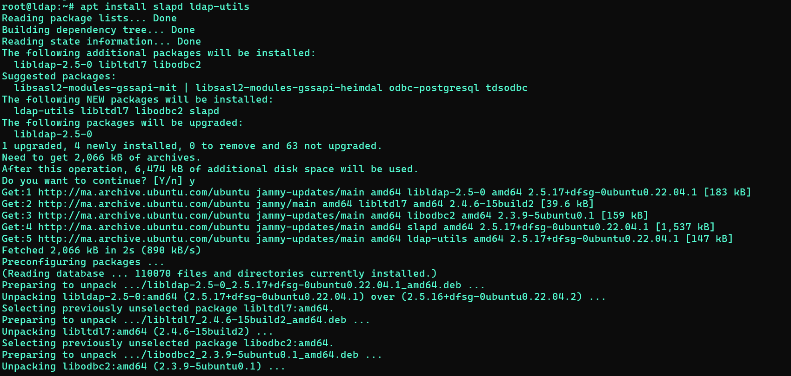

During the installation, you will be prompted to configure administrator password for your LDAP server. Provide a strong one and hit ENTER.


Next, re-enter the password to confirm your password and hit ENTER.


### 3)  Setup OpenLDAP Server

```
# dpkg-reconfigure slapd
```

The command will prompt a series of questions on your terminal. Initially, select the ‘No’ option at the first prompt to ensure the OpenLDAP server configuration is not skipped.


Subsequently, input a DNS domain name. This will be utilized to construct the base DN of the LDAP directory. For instance, in this example, we'll use the domain name server.io, resulting in the DN represented as “dc=server,dc=io”. Then, press ‘ENTER’.

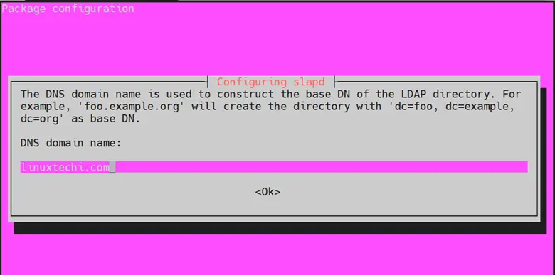


Following that, supply a name for your organization, which will also be incorporated into the base DN. In alignment with our previous example, we'll use the same name as the domain name.

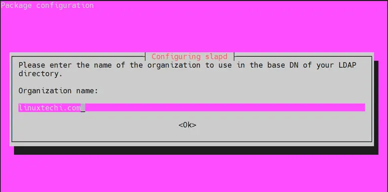

Following that, input the Administrator password for your LDAP directory and press ‘ENTER’.

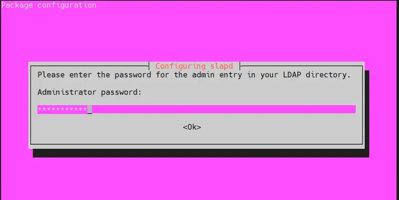

Ensure to confirm the password by retyping it and then press ‘ENTER’.


When prompted regarding the removal of the database when slapd is purged, select ‘NO’.


Lastly, select ‘Yes’ to remove the old database, making space for the new database.


Finally, you should see the following output.

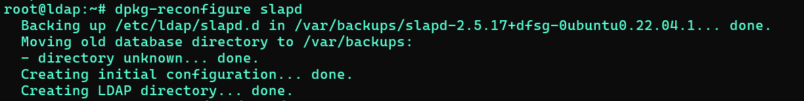

Next, you'll need to make modifications to the main OpenLDAP configuration file. Open it using your preferred text editor. In this example, we'll use nano.

```
$ sudo nano /etc/ldap/ldap.conf
```

Locate and uncomment the lines beginning with “BASE” and “URI” and provide the domain name for your OpenLDAP server. In our case, the “BASE” is “dc=server,dc=io” and the “URI” for the OpenLDAP server is “ldap://ldap.server.io.

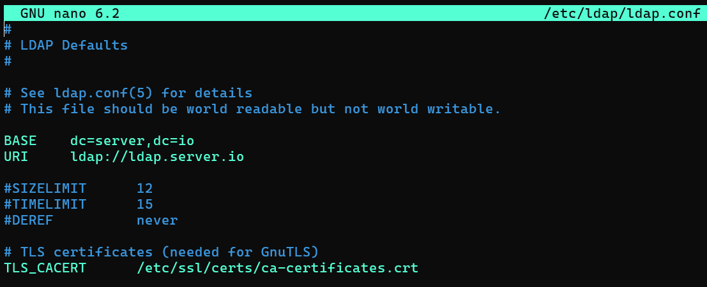

Save the changes and exit the configuration file. Then restart the slapd daemon and check its status using the following commands.

```
$ systemctl restart slapd
$ systemctl status slapd
```

Then execute the following command to confirm the basic configuration of OpenLDAP. You should receive the following output.

```
# ldapsearch -Q -LLL -Y EXTERNAL -H ldapi:///
```

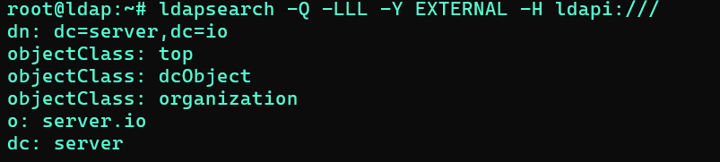

### 4) Setup Base group for OpenLDAP Users

The subsequent step involves creating a new base group for OpenLDAP users. In this demonstration, we will create two base groups: "people" and "groups". The ‘people’ group will store regular users, while the ‘groups’ group will manage the groups on your LDAP server.

Therefore, we will create the base-groups file as follows.

```
# nano base-groups.ldif
```

Paste the following lines to the configuration file.


Save the changes and exit.

To add the base groups, execute the command ldapadd against the ‘base-groups.ldif’ file. When prompted, provide the OpenLDAP admin password and press ‘ENTER’.

```
# ldapadd -x -D cn=admin,dc=server,dc=io -W -f base-groups.ldif
```

The output will display information informing you that the groups have successfully been added.

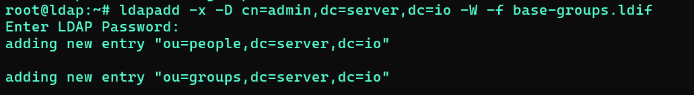

To confirm that the groups have been added, run the following command.

```
# ldapsearch -Q -LLL -Y EXTERNAL -H ldapi:///
```

The command generates a block of output displaying all the details of your LDAP configuration including the groups we have just created.

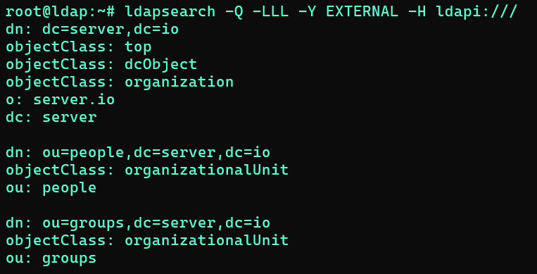

### 5) Add a new group to the Base Group

With the base groups already created, in this section, we will proceed to add a new group to the ‘groups’ base group.

To achieve this, we will create a new group file called group.ldif.

```
# nano group.ldif
```

Paste the following lines of code. Here, we have specified a new group called support_engineers with a group ID of 5000.

```
dn: cn=support_engineers,ou=groups,dc=server,dc=io
objectClass: posixGroup
cn: support_engineers
gidNumber: 5000
```

Once done, save the changes and exit the configuration file. Then run the command below to add the ‘support_engineers’ group to the ‘groups’ group.

```
# ldapadd -x -D cn=admin,dc=server,dc=io -W -f group.ldif
```

The command generates the following output confirming that the support_engineers group was successfully added.


Then execute the following command to verify that the group ‘support_engineers’ is part of the ‘groups’ group with a GID of ‘5000’.

```
# ldapsearch -x -LLL -b dc=server,dc=io '(cn=support_engineers)' gidNumber
```

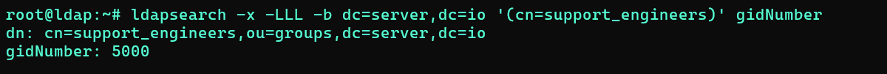

### 5) Create a new OpenLDAP User

The final step is to create an OpenLDAP user and associate the user with a specific base group. However, before proceeding, you need to generate an encrypted password for the user. Execute the following command, ensuring to provide a strong password.

```
# slappasswd
```

The password will be printed in an encrypted format. Copy the entire password beginning with {SSHA}to the last character and paste it somewhere as you will need this in the next step.

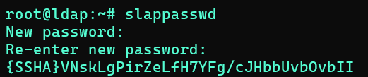

Next, create a new user file as shown.

```
# nano user.ldif
```

Paste the following lines of code. In this configuration, we are creating a new user called ‘Mehdi’ with a UID of 7000. The default home directory will be “/home/mehdi” and the default login shell “/bin/bash”. The new user will be a part of the base group called ‘people’ with a GID of 7000.

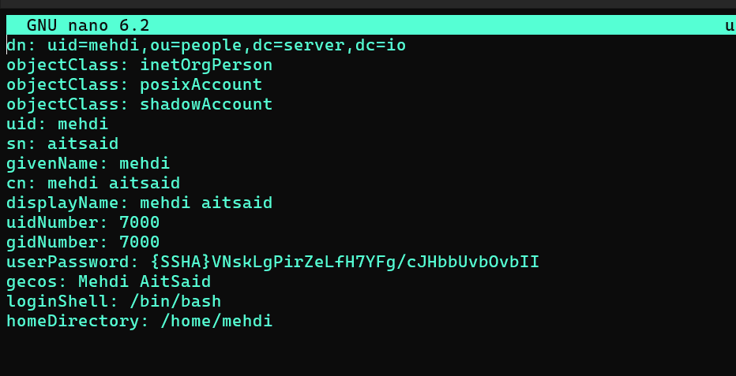

Save and exit the configuration file

To add the user to the ‘people’ group, run the following command:

```
# ldapadd -x -D cn=admin,dc=server,dc=io -W -f user.ldif
```

You should get the following confirmation output.

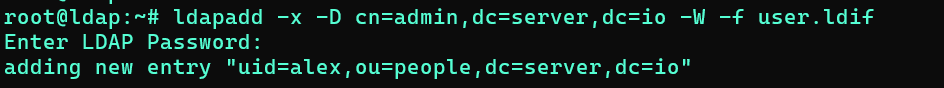

To confirm the creation of the user, execute the command.

```
# ldapsearch -x -LLL -b dc=server,dc=io '(uid=alex)' cn uidNumber gidNumber
```

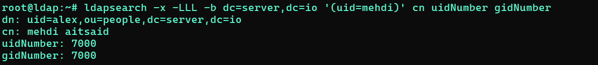


### 6) Configure LDAP Client in order to share user accounts in your local networks.

Install LDAP Client Packages

```
# apt -y install libnss-ldapd libpam-ldapd ldap-utils
```

Configure LDAP Connection:

Edit the LDAP client configuration file (/etc/ldap/ldap.conf or /etc/openldap/ldap.conf) to specify the LDAP server's URI, base DN, and other connection parameters.


Configure Name Service Switch (NSS):

Configure the Name Service Switch (/etc/nsswitch.conf) to use LDAP for user authentication, group lookup, and other services.
Example configuration:

```
passwd:         files ldap
group:          files ldap
shadow:         files ldap
```

Configure PAM Authentication:

Configure the Pluggable Authentication Modules (PAM) system to use LDAP for user authentication.
Edit PAM configuration files in /etc/pam.d/ (e.g., common-auth, common-account, common-password, common-session) to include LDAP authentication.
Example configuration (in common-auth):

```
# sudo nano /etc/pam.d/common-session
```

```
auth    [success=1 default=ignore]      pam_unix.so nullok_secure
auth    requisite                       pam_deny.so
auth    required                        pam_ldap.so use_first_pass
```

Test the LDAP connection using utilities like ldapsearch or getent.

```
ldapsearch -x -LLL -H ldap://ldap.server.io -b dc=server,dc=io '(uid=mehdi)' getent passwd
```

Restart Service:

```
sudo systemctl restart nscd
```

Test user authentication by logging in with LDAP user credentials on the client system.


