# Install and Configure SMTP Server with Postfix on Ubuntu


SMTP (Simple Mail Transfer Protocol) is a program used to facilitate the sending, receiving, and relaying of outgoing emails between mail servers, enabling communication between senders and receivers. This section provides a guide on installing and configuring an SMTP server with Postfix on Ubuntu. SMTP is essential for email communication, as it determines which servers will receive relay messages.

A mail server encompasses systems responsible for collecting, processing, and delivering email messages. Every email message must pass through a mail server before reaching its intended recipient, much like a traditional mail carrier.

Without servers, email communication would be limited to recipients within the same domain. SMTP servers provide addresses that mail clients or applications can establish connections with, facilitating the transmission of emails.

Postfix serves as the mail transfer agent (MTA) for sending and receiving emails. It can be configured to restrict usage to local applications, which proves useful in scenarios where third-party email service providers impose limitations on sending email notifications or when handling significant outgoing traffic. Despite its lightweight nature, Postfix retains essential functionality, making it a suitable option for maintaining an efficient SMTP server setup.

## Prerequisites

Configure DNS settings on your Ubuntu server to ensure proper domain resolution. DNS plays a crucial role in email delivery by translating domain names into IP addresses and vice versa. Proper DNS configuration ensures that your SMTP server can resolve domain names and deliver emails to the correct destinations.

If you do not have access to a DNS server, you can still configure your mail server using the local hostname method. This involves manually setting the hostname and ensuring it resolves correctly within your local network. Here’s how you can do it:

## Setting up and configuring the hostname for a mail server 

1. Check Current Hostname:
Open a terminal and type the following command to check your current hostname:

```
$ hostnamectl
```

2. Set the New Hostname:
Use the hostnamectl command to set a new hostname. Replace your-new-hostname with your desired hostname:

```
$ sudo hostnamectl set-hostname your-new-hostname
```

3. Edit the /etc/hosts File:
Open the /etc/hosts file in a text editor:
```
$ sudo nano /etc/hosts
```

Add or modify the lines to associate your new hostname with the loopback address. For example:
```
127.0.0.1   localhost
127.0.1.1   example.com
xxx.xxx.xxx.xxx   example.com # server ip
xxx.xxx.xxx.xxx   mail.example.com # server ip
```

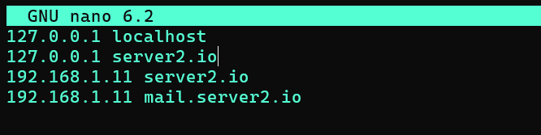

## 1. Install & Configure Postfix

Connect to your server via SSH and install the Postfix server by executing the following commands:

```
$ sudo apt update -y
$ sudo apt install -y postfix
```

You'll get the Postfix configuration screen, as shown below. Press TAB and ENTER to continue.

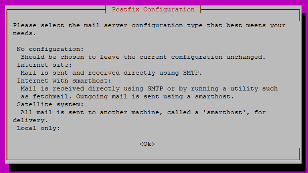

On the next screen, select Internet Site, then TAB and ENTER.

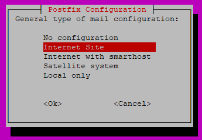

Enter the system mail name, which is your domain name. For instance, the server name is mail.example.com, so you'll enter example.com here.

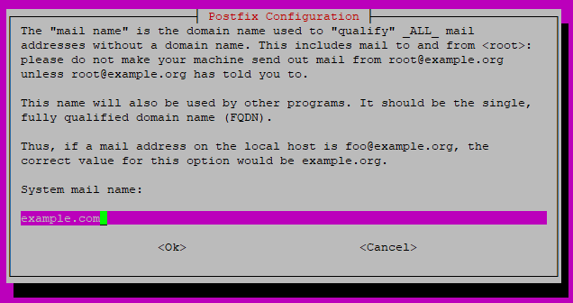

Back up the the /etc/postfix/main.cf file, and create a new one.

```
 $ sudo mv /etc/postfix/main.cf /etc/postfix/main.cf.bk
 $ sudo nano /etc/postfix/main.cf
```
Enter the information below to the new file. Replace example.com with your domain name throughout the file.

```
smtpd_banner = $myhostname ESMTP $mail_name
biff = no
append_dot_mydomain = no
readme_directory = no

# TLS parameters
smtp_use_tls = yes
smtp_tls_security_level = may
smtp_tls_session_cache_database = btree:${data_directory}/smtp_scache

smtpd_use_tls = yes
smtpd_tls_security_level = may
smtpd_tls_session_cache_database = btree:${data_directory}/smtpd_scache
smtpd_tls_cert_file = /etc/letsencrypt/live/example.com/fullchain.pem
smtpd_tls_key_file = /etc/letsencrypt/live/example.com/privkey.pem
smtpd_relay_restrictions = permit_mynetworks, permit_sasl_authenticated,  reject_unauth_destination

smtpd_sasl_auth_enable = yes
smtpd_sasl_type = dovecot
smtpd_sasl_path = private/auth

virtual_transport = lmtp:unix:private/dovecot-lmtp
virtual_mailbox_domains = /etc/postfix/virtual_mailbox_domains

myhostname = mail.example.com
myorigin = /etc/mailname
mydestination =  localhost.$mydomain, localhost
relayhost = 
mynetworks = 127.0.0.0/8 [::ffff:127.0.0.0]/104 [::1]/128
mailbox_size_limit = 0
recipient_delimiter = +
inet_interfaces = all
inet_protocols = all
alias_maps = hash:/etc/aliases
alias_database = hash:/etc/aliases
```
Save and close the file.

## 2. Create Virtual Mail Box Domains

The main.cf configuration file instructs postfix to look for email domains in the /etc/postfix/virtual_mailbox_domains file. Create the file:

```
$ sudo nano /etc/postfix/virtual_mailbox_domains
```

Add the information below to the file and replace example.com with your domain name.

```
example.com #domain
```

Use the postmap command to change /etc/postfix/virtual_mailbox_domains to a format recognizable by Postfix. Run this command every time you edit the file, for instance, after adding more domains to the file.

$ sudo postmap /etc/postfix/virtual_mailbox_domains

Edit the /etc/postfix/master.cf configuration file to enable the SMTP service.

```
$ sudo nano /etc/postfix/master.cf
```

Find the entry below.
```
...
#submission inet n       -       y       -       -       smtpd
...
```
Remove the pound symbol at the beginning of the line.

```
...
submission inet n       -       y       -       -       smtpd
...
```

Save and close the file.


## 3. Install & Configure Dovecot

Install the Dovecot package and all the dependency packages required to run the imap, pop3, and lmtp service.

```
$ sudo apt install -y dovecot-core dovecot-imapd dovecot-pop3d dovecot-lmtpd
```

Edit the /etc/dovecot/conf.d/10-mail.conf file to instruct Dovecot on the directory to look for mails.

```
$ sudo nano /etc/dovecot/conf.d/10-mail.conf
```

Find the entry below.

```
mail_location = mbox:~/mail:INBOX=/var/mail/%u   
```

Change to:

```
mail_location = maildir:/var/mail/vhosts/%d/%n
```

Save and close the file. The %d represents the domain, and %n represents the users. This means that you'll need to create a sub-directory in the /var/mail/vhosts for every domain receiving emails on your server.

Create the first sub-directory and replace example.com with your domain name.

```
$ sudo mkdir -p /var/mail/vhosts/example.com
```

Create a Vmail user and group for the Dovecot service.

Create the vmail group.

```
$ sudo groupadd -g 5000 vmail
```

Create a vmail user and add the user to the vmail group.

```
$ sudo useradd -r -g vmail -u 5000 vmail -d /var/mail/vhosts -c "virtual mail user"
```

Assign the ownership of the /var/mail/vhosts/ to the vmail user and group.

```
$ sudo chown -R vmail:vmail /var/mail/vhosts/
```

Edit the Dovecot 10-master.conf file.

```
$ sudo nano /etc/dovecot/conf.d/10-master.conf
```

Locate the entries below.

```
 ...
 inet_listener imaps {
   #port = 993
   #ssl = yes
 }
 ...
```

Remove the pound symbol before the port and ssl entries, as shown below, to allow Dovecot to use port 993 and SSL for secure IMAP.

```
 ...
 inet_listener imaps {
   port = 993
   ssl = yes
 }
 ...
```

Locate the entries below.

```
 ...
 inet_listener pop3s {
   #port = 995
   #ssl = yes
 }
 ...
```
Remove the pound symbol before the port = 995 and ssl = yes parameters.

```
 ...
 inet_listener pop3s {
   port = 995
   ssl = yes
 }
 ...
```

Enable the lmtp service. Locate the entries below.

```
 ...
 service lmtp {
   unix_listener lmtp {
     #mode = 0666
   }

   # Create inet listener only if you can't use the above UNIX socket
   #inet_listener lmtp {
     # Avoid making LMTP visible for the entire internet
     #address =
     #port =
   #}
 }
 ...
```

Change the configuration to:

```
 ...
 service lmtp {
   unix_listener /var/spool/postfix/private/dovecot-lmtp {
     mode = 0600
     user = postfix
     group = postfix
   }
 }
 ...
```

Locate the Dovecot authentication socket configurations below.

```
...
# Postfix smtp-auth
#unix_listener /var/spool/postfix/private/auth {
#  mode = 0666
#}
... 
```
Change the configuration to:

```
...
#Postfix smtp-auth
unix_listener /var/spool/postfix/private/auth {
  mode = 0666
  user = postfix
  group = postfix
}
...
```

Save and close the file.

Configure Dovecot to use secure authentication. Edit the Dovecot 10-auth.conf file.

```
$ sudo nano /etc/dovecot/conf.d/10-auth.conf
```

Find the entry below.

```
# disable_plaintext_auth = yes
```
Uncomment the setting above by removing the # character to disable plain text authorization.

```
disable_plaintext_auth = yes
```

Find the entry below.

```
auth_mechanisms = plain
```

Change the authentication mechanisms from plain to plain login.

```
auth_mechanisms = plain login
```

Disable the Dovecot default authentication behavior that requires users to have a system account to use the email service. Find the line:

```
!include auth-system.conf.ext
```

Add a pound symbol at the beginning of the line to comment it out.

```
#!include auth-system.conf.ext
```

Find the line:

```
#!include auth-passwdfile.conf.ext
```

Remove the # symbol at the beginning to enable Dovecot to use a password file.
```
!include auth-passwdfile.conf.ext
```

Save and close the file.

Edit the Dovecot password file, auth-passwdfile.conf.ext.

```
$ sudo nano /etc/dovecot/conf.d/auth-passwdfile.conf.ext
```

The file looks similar to the one shown below.

```
passdb {
  driver = passwd-file
  args = scheme=CRYPT username_format=%u /etc/dovecot/users
}

userdb {
  driver = passwd-file
  args = username_format=%u /etc/dovecot/users
...
}
```

Make the changes to the file, as shown below.

```
passdb {
    driver = passwd-file
    args = scheme=PLAIN username_format=%u /etc/dovecot/dovecot-users
}

userdb {
    driver = static
    args = uid=vmail gid=vmail home=/var/mail/vhosts/%d/%n    
}
```

Save and close the file.

Create the /etc/dovecot/dovecot-users password file. This file is a plain text database that holds email users on your server.

```
$ sudo nano /etc/dovecot/dovecot-users
```

Add the users that you want to use the email service to the file by following the format below. Replace EXAMPLE_PASSWORD with your password. Also, replace example.com with your domain name.

```
admin@example.com:{plain}EXAMPLE_PASSWORD
info@example.com:{plain}EXAMPLE_PASSWORD
billing@example.com:{plain}EXAMPLE_PASSWORD
```

Like this :

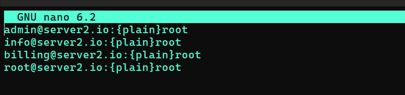


Save and close the file.

Restart the postfix and dovecot services to use the new settings.

```
$ sudo service postfix restart 
$ sudo service dovecot restart
```

## 4. Install & Configure Roundcube

Roundcube is a free, open-source webmail client that allows users to manage their emails through a web interface. It's designed to be user-friendly, resembling the look and feel of a desktop email application, but it runs on a web server.

### 4.1 Install PHP
```
$ sudo apt -y install php8.1 php8.1-mbstring php-pear
$ php -v
```
Verify installation to create a test script

```
$ echo '<?php echo `php -i`."\n"; ?>' > php_test.php
$ php php_test.php | head

Output
phpinfo()
PHP Version => 8.1.2

System => Linux dlp.srv.world 5.15.0-25-generic #25-Ubuntu SMP Wed Mar 30 15:54:22 UTC 2022 x86_64
Build Date => Apr  7 2022 17:46:26
Build System => Linux
Server API => Command Line Interface
Virtual Directory Support => disabled
Configuration File (php.ini) Path => /etc/php/8.1/cli
Loaded Configuration File => /etc/php/8.1/cli/php.ini
```

### 4.2 Install Apache2

```
$ sudo apt -y install php-fpm apache2
```

Add Settings in Virtualhost you'd like to set PHP-FPM.

```
$ sudo nano /etc/apache2/sites-available/default-ssl.conf
```

Add into <VirtualHost> - </VirtualHost>

```
    <FilesMatch \.php$>
        SetHandler "proxy:unix:/var/run/php/php8.1-fpm.sock|fcgi://localhost/"
    </FilesMatch>
```

Enable the configuration

```
$ sudo a2enmod proxy_fcgi setenvif

Output
Considering dependency proxy for proxy_fcgi:
Enabling module proxy.
Enabling module proxy_fcgi.
Module setenvif already enabled
To activate the new configuration, you need to run:
  systemctl restart apache2
``` 


```
$ sudo a2enconf php8.1-fpm

Output
Enabling conf php8.1-fpm.
To activate the new configuration, you need to run:
  systemctl reload apache2
``` 

Restart the appache server amd PHP FPM
```
$ sudo systemctl restart php8.1-fpm apache2
```

Create [phpinfo] in Virtualhost's web-root you set PHP-FPM and access to it, then that's OK if [FPM/FastCGI] is displayed.

```
$ sudo echo '<?php phpinfo(); ?>' > /var/www/html/info.php
```

### 4.3 Install MariaDB to configure Database Server.

```
$ sudo apt -y install mariadb-server
```

Initial Settings for MariaDB.
```
$ sudo mysql_secure_installation

Output

NOTE: RUNNING ALL PARTS OF THIS SCRIPT IS RECOMMENDED FOR ALL MariaDB
      SERVERS IN PRODUCTION USE!  PLEASE READ EACH STEP CAREFULLY!

In order to log into MariaDB to secure it, we'll need the current
password for the root user. If you've just installed MariaDB, and
haven't set the root password yet, you should just press enter here.

Enter current password for root (enter for none):
OK, successfully used password, moving on...

Setting the root password or using the unix_socket ensures that nobody
can log into the MariaDB root user without the proper authorisation.

You already have your root account protected, so you can safely answer 'n'.

# Switch to [unix_socket] authentication or not
# [unix_socket] auth is enabled for root user by default even if you select [No]
Switch to unix_socket authentication [Y/n] n
 ... skipping.

You already have your root account protected, so you can safely answer 'n'.

# set MariaDB root password or not
# [unix_socket] authentication is enabled by default, but
# if you set root password, it's also possible to login with password authentication.
# if not set root password, only OS root user can login as MariaDB root user
Change the root password? [Y/n] Y
 ... set your root password.

By default, a MariaDB installation has an anonymous user, allowing anyone
to log into MariaDB without having to have a user account created for
them.  This is intended only for testing, and to make the installation
go a bit smoother.  You should remove them before moving into a
production environment.

# remove anonymous users
Remove anonymous users? [Y/n] n
 ... Success!

Normally, root should only be allowed to connect from 'localhost'.  This
ensures that someone cannot guess at the root password from the network.

# disallow root login remotely
Disallow root login remotely? [Y/n] n
 ... Success!

By default, MariaDB comes with a database named 'test' that anyone can
access.  This is also intended only for testing, and should be removed
before moving into a production environment.

# remove test database
Remove test database and access to it? [Y/n] n
 - Dropping test database...
 ... Success!
 - Removing privileges on test database...
 ... Success!

Reloading the privilege tables will ensure that all changes made so far
will take effect immediately.

# reload privilege tables
Reload privilege tables now? [Y/n] y
 ... Success!

Cleaning up...

All done!  If you've completed all of the above steps, your MariaDB
installation should now be secure.

Thanks for using MariaDB!

```

### 4.3 Install Roundcube

To access Postfix and Dovecot servers, install Roundcube email client.

```
$ sudo apt -y install roundcube roundcube-mysql
```
Press ENTER to configure the database for use with Roundcube.

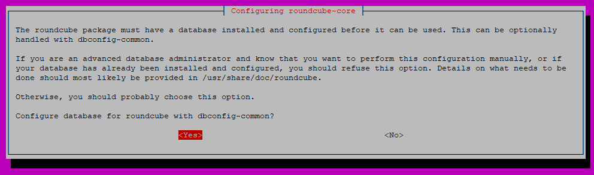

On the next screen, enter a MySQL password to use with Roundcube.

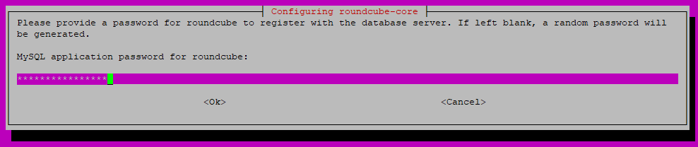

Press TAB and ENTER.

Set the host server:

```
$ sudo nano /etc/roundcube/config.inc.php
```

Change $config['default_host'] and $config['smtp_server'] to localhost

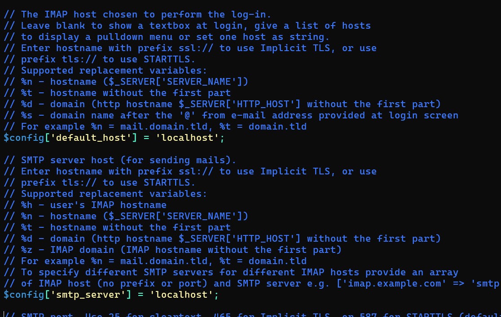

Setup Roundcube with Apache
```
$ sudo /etc/apache2/conf-enabled/roundcube.conf
```
Uncomment line 3 
``` 
Alias /roundcube /var/lib/roundcube/public_html
```

Restart Apache
```
$ sudo systemctl restart apache2
```

Access to [https://(your server's hostname or IP address/)/roundcube/], then Roundcube login form is shown, authenticate with any user on Mail Server.

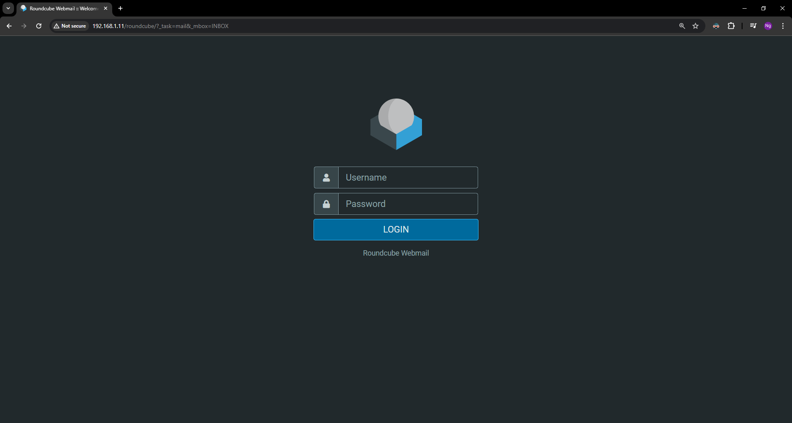

## 5. Test

### Step 1: Log in to the First Email Account

- Enter the first email address (ex : admin@server2.io) in the username field.
- Enter the corresponding password in the password field.
- Click the "Login" button to access the email account.\

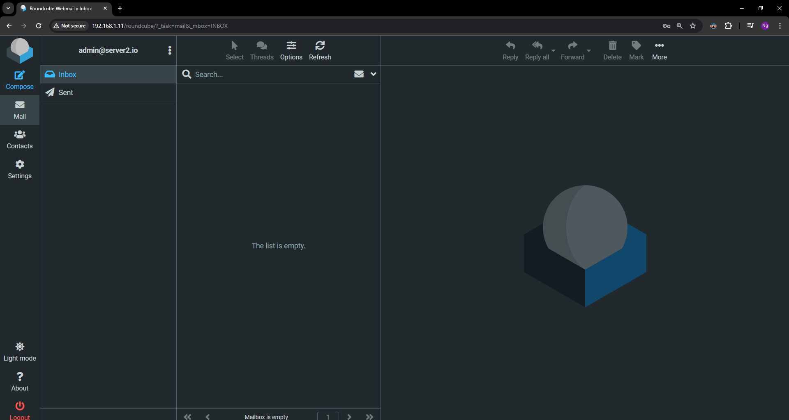

### Step 2: Compose and Send an Email
- Once logged in, click the "Compose" button, usually found in the top menu or sidebar.
- In the "To" field, enter the recipient's email address  (ex: info@server2.io).
- Fill in the "Subject" field with an appropriate subject line (e.g., "Test Email").
- Type your message in the body of the email.
- Click the "Send" button to send the email.

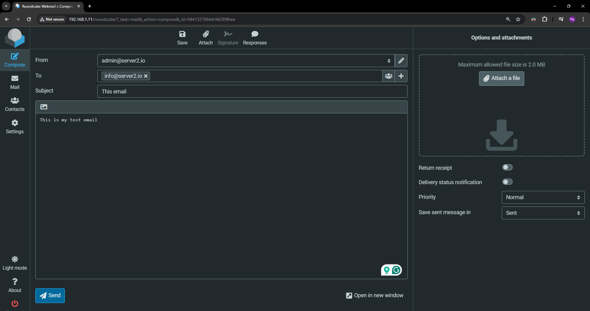

### Step 3: Log Out of the First Email Account
Click on the "Logout" button, usually found in the top right corner of the interface, to log out of the admin@server2.io account.

### Step 4: Log in to the Second Email Account
- On the Roundcube login page, enter the second email address (ex: info@server2.io) in the username field.
- Enter the corresponding password in the password field.
- Click the "Login" button to access the email account.

### Step 5: Check for the Received Email
- Once logged in, navigate to the "Inbox" or main email folder.
- Look for the email sent from admin@server2.io. It should appear in the list of received emails.
- Click on the email to open and read it, verifying that the message was received successfully.

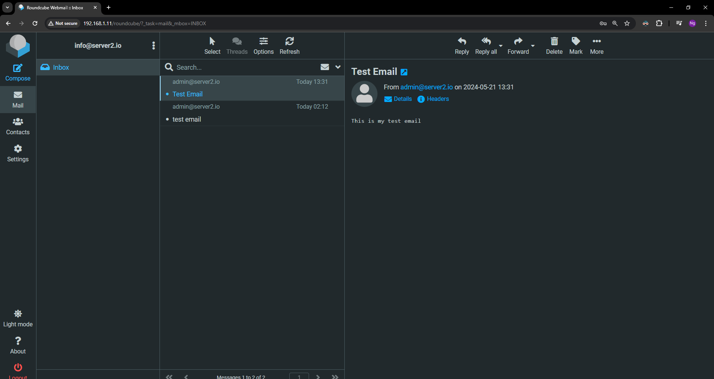

## Final Task: Setting Up Email Communication Between Two Servers

Objective: Set up two separate mail servers on different virtual machines (VMs) and send an email between them to ensure proper configuration and functionality.

Task:

1. Create Two Virtual Machines: Set up two VMs, naming them Server1 and Server2.

2. Install Mail Server Software: On both Server1 and Server2, install the necessary mail server software (e.g., Postfix, Dovecot, etc.). Ensure both servers have the required dependencies and are updated to the latest versions.

3. Configure DNS Records: Set up appropriate DNS records (MX, A, and PTR) for both servers to ensure proper mail routing. For example, Server1 should be associated with mail.server1.com and Server2 with mail.server2.com.  **Alternatively, you can use local hostnames if you do not want to configure DNS.**

4. Set Up Roundcube on Both Servers: Install and configure Roundcube webmail client on both Server1 and Server2. Ensure Roundcube is properly connected to the mail servers for both sending and receiving emails.

5. Create Email Accounts: On Server1, create an email account admin@server1.com. On Server2, create an email account info@server2.com.

6. Send an Email from Server1 to Server2: Log in to the Roundcube webmail interface on Server1 using the admin@server1.com account. Compose and send an email to info@server2.com. Ensure that the email is sent without errors.

7. Check Email Receipt on Server2: Log in to the Roundcube webmail interface on Server2 using the info@server2.com account. Check the inbox to ensure that the email sent from admin@server1.com has been received.

8. Send a Reply from Server2 to Server1: Reply to the received email from info@server2.com back to admin@server1.com. Ensure that the reply is sent without errors.

9. Verify Email Receipt on Server1: Log in to the Roundcube webmail interface on Server1 using the admin@server1.com account. Check the inbox to ensure that the reply from info@server2.com has been received.


**Document the Process** Provide a detailed report documenting each step of the setup process, configurations made, and any issues encountered along with their resolutions. Include screenshots of key steps and the successful email communications.

**Submission:** Submit the report and screenshots through the designated submission platform by the due date. Ensure all configurations are properly documented for verification.

**Evaluation Criteria:** Successful installation and configuration of mail servers on both VMs, proper DNS setup for email routing, correct installation and configuration of Roundcube on both servers, successful sending and receiving of emails between the two servers, and the quality and completeness of the documentation provided.