# Lab: Creating a New Virtual Machine on ESXi

In this lab, you will learn how to create a new VM on a standalone ESXi host.

## Prerequisites
- Access to the ESXi web client.
- Administrator privileges on the ESXi host.
- Knowledge of the VM specifications (CPU, memory, storage, OS) required for your use case.

**Lab Note**: For our labs, we will be using the **Ubuntu Server Live** ISO as the guest operating system.

## Steps for Creating a New VM

### 1. Log in to the ESXi Web Client
- Open a web browser and navigate to your ESXi host’s IP address.
- Log in using your username and password with administrator privileges.

### 2. Start the VM Creation Wizard
- In the **Navigator** pane on the left, click on **Virtual Machines**.
- Click **Create / Register VM** to open the New Virtual Machine wizard.

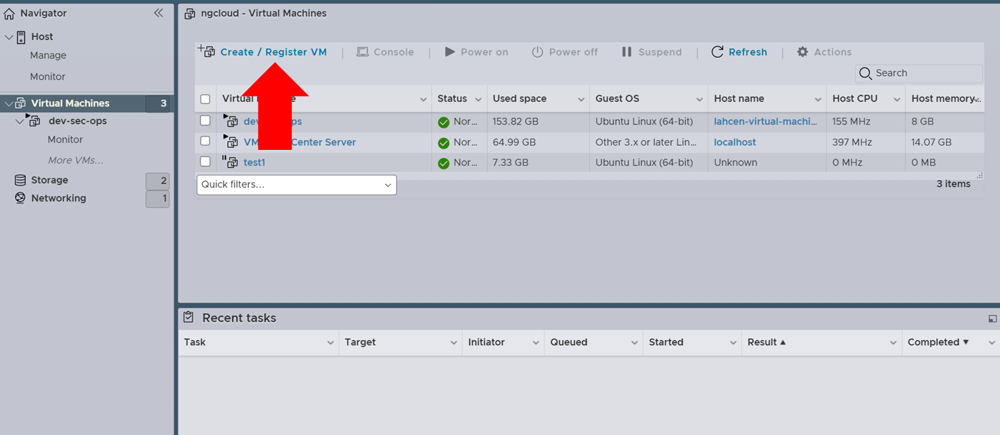

### 3. Select the Creation Type
- Choose **Create a new virtual machine**.
- Click **Next** to proceed.

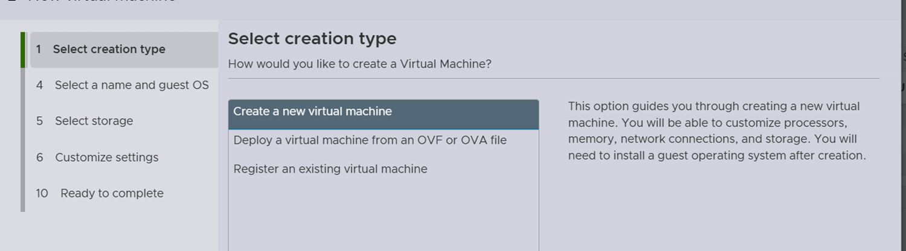

### 4. Name the VM and Select Compatibility
- Enter a **Name** for the VM that will make it easy to identify.
- Select the **Compatibility** setting, which defines the virtual hardware version. Typically, the default option is suitable.
- Click **Next** to continue.

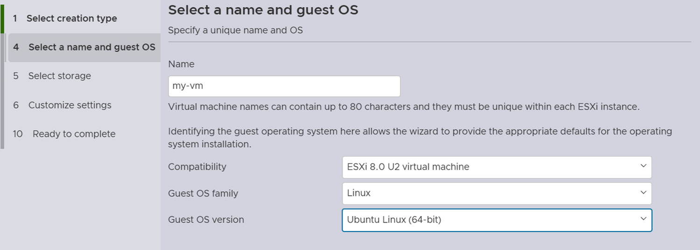

### 5. Select a Datastore
- Choose a **Datastore** on the ESXi host where the VM files will be stored.
- Make sure there is sufficient space available for the VM.
- Click **Next** to proceed.

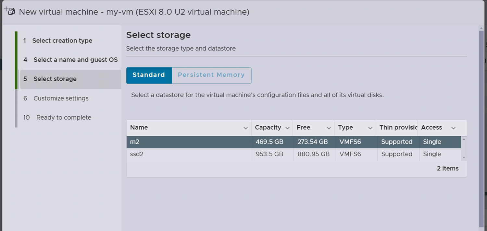

### 6. Configure Virtual Hardware
- Specify the virtual hardware for the VM:
  - **CPU**: Enter the number of virtual CPUs you want to allocate.
  - **Memory**: Allocate the required memory (RAM) for the VM.
  - **Hard Disk**: Adjust the disk size, or add additional disks if necessary.
  - **Network Adapter**: Select the appropriate network for the VM to connect to.
  - **CD/DVD Drive**: Attach an ISO file if you are installing an OS **(See step 7)**. 
- **Additional Configuration**:
  - Expand and configure other settings, such as **Video Card**, **SCSI Controller**, or **USB Controller**, depending on your needs.

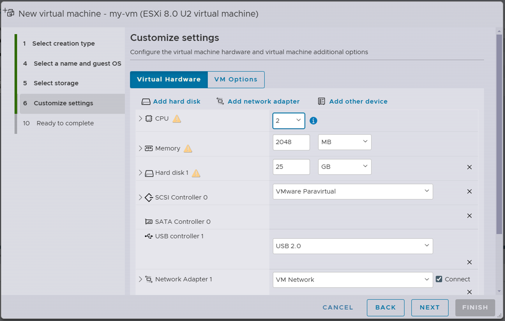

### 7. Select the Guest Operating System
- Choose the **Guest OS Family** (e.g., Windows, Linux) and the specific **Guest OS Version** that matches the OS you plan to install.
  - **Note**: Selecting the correct guest OS is important as it influences the default virtual hardware settings.
  - If you haven't already uploaded the OS ISO, go to **Datastore Browser** in the ESXi interface, navigate to the appropriate datastore, and upload the ISO file. Once uploaded, attach the ISO to the VM's **CD/DVD Drive**.

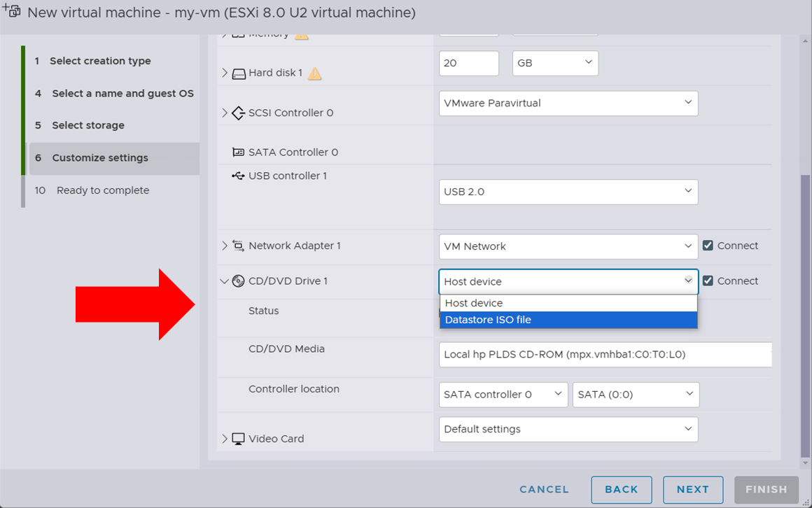

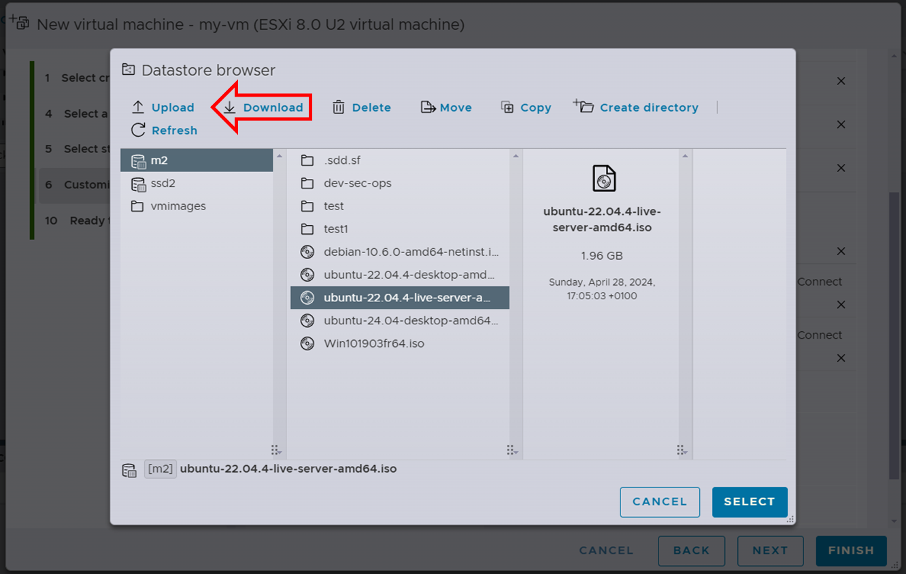

### 8. Review and Complete
- Review the settings on the **Ready to complete** screen.
- If all settings are correct, click **Finish** to create the VM.

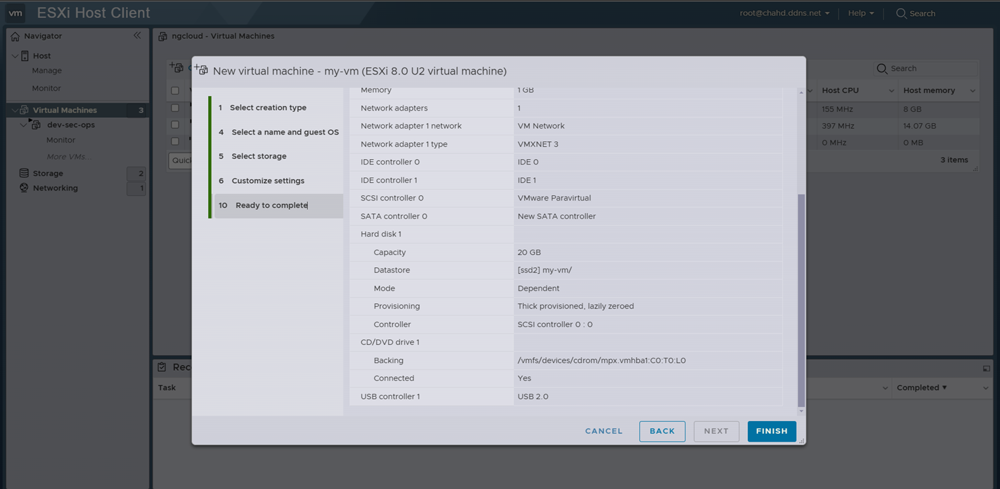

### 9. Power On the VM and Install the Guest OS
- In the **Virtual Machines** list, locate the new VM.
- Select the VM, then click **Power On**.
- Use the **Console** tab to open the VM console and proceed with the installation of the guest OS.

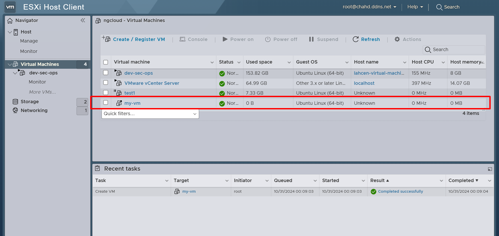

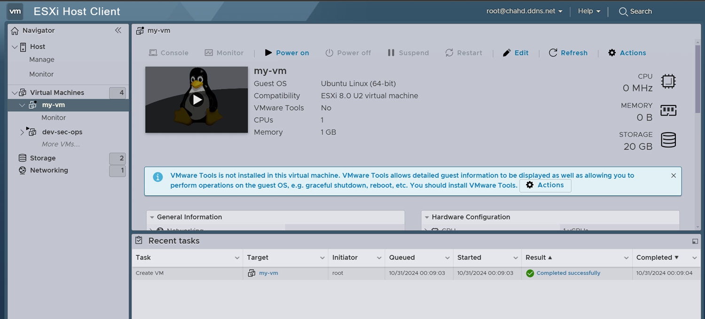

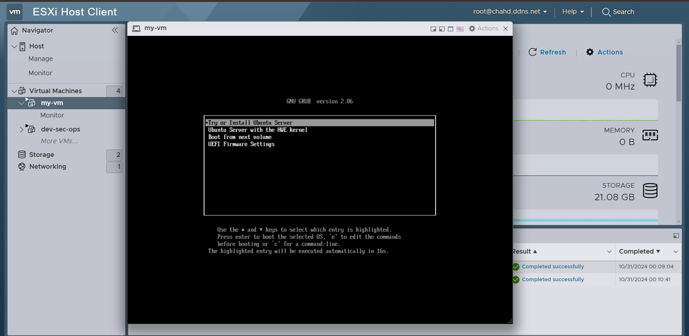