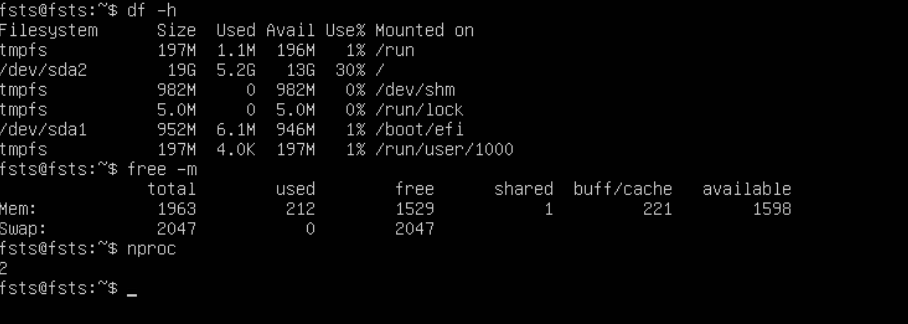
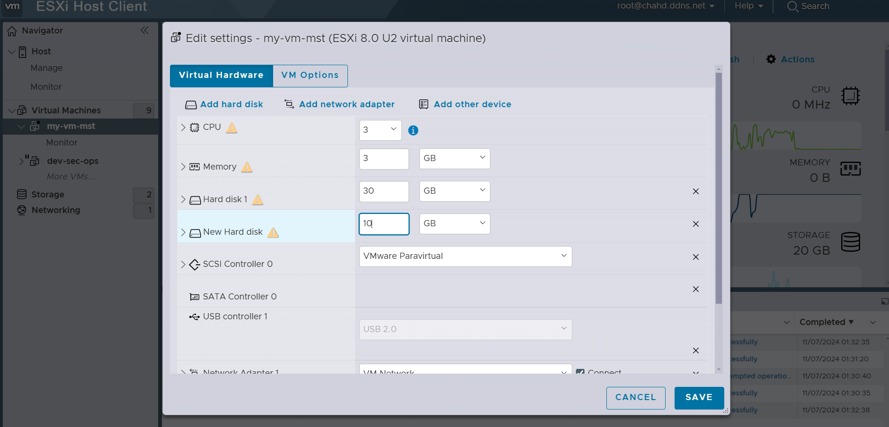
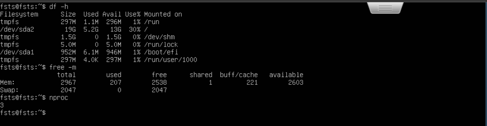

# Lab: Expanding Resources on a Virtual Machine in ESXi

In this lab, you will learn how to adjust the resources of a virtual machine (VM) on ESXi, including CPU, RAM, and disk storage. Before making changes, you will record the current state of the VM's resources.

## Step 1: Record Current VM Resources

1. **Log in to the VM** (e.g., via SSH or the VM console in the ESXi web interface).
2. Run the following commands to view the current disk, memory, and CPU usage:
   - `df -h`: Displays disk storage information.
   - `free -m`: Shows the memory (RAM) usage in megabytes.
   - `nproc`: Displays the number of CPU cores available.

Record the output for each command to compare later.

## Step 2: Adjust VM Resources

> **Note:** Not all versions of ESXi support changing CPU and memory allocations while the VM is running. Hot-add capabilities, which allow adding CPUs and memory without powering off the VM, depend on several factors:
> 
> - **ESXi Version and License**: Newer ESXi versions may support hot-add, but it often requires a specific license level (e.g., Enterprise Plus).
> - **VM Compatibility Level**: The virtual hardware version of the VM impacts hot-add support. Older hardware versions might not allow it even if the ESXi host does.
> - **Guest OS Compatibility**: The guest OS must also support hot-add for these changes to apply without a reboot.
> - **VM Configuration**: Hot-add must be enabled in the VM settings under "CPU" and "Memory" before starting the VM (e.g., by selecting "Enable CPU Hot Add" and "Memory Hot Add").

> For this lab, it is recommended to **power off the VM** before making changes to resources (RAM, CPU, or disk) and then **power it back on** after adjustments. This ensures compatibility across different ESXi versions.

### Adjusting RAM

1. In the ESXi **Web Client**, go to the **Virtual Machines** section.
2. Right-click on the VM you want to edit and select **Edit Settings**.
3. Under **Memory**, adjust the RAM allocation to the desired amount.
4. Click **Save** or **OK** to apply the changes.

### Adding a New CPU

1. In the **Edit Settings** menu of the VM, find the **CPU** section.
2. Increase the **Number of CPUs** or **Cores per Socket** as needed.
3. Save the configuration.

### Expanding the Current Disk

1. In the **Edit Settings** menu, locate the **Hard Disk** section.
2. Select the primary disk and increase the **Provisioned Size** to expand the disk.
3. Confirm and save the changes.

### Adding a New Disk

1. Still in **Edit Settings**, click **Add New Device** and select **Hard Disk**.
2. Specify the size and other settings for the new disk.
3. Save the configuration.

## Step 3: Verify Changes

1. Start or restart the VM if necessary to apply the new configuration.
2. Log back into the VM and run the following commands to verify the updated resources:
   - `df -h`: Check for disk storage changes.
   - `free -m`: Verify the new RAM allocation.
   - `nproc`: Confirm the updated CPU count.

You should see that the CPU and RAM adjustments took effect immediately. However, the disk changes may not appear within the VM.

- **Question**: Why do you think the disk changes are not visible within the VM? How would you resolve this?
