# ESXi and vSphere

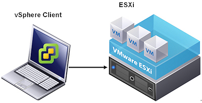

ESXi and vSphere form the backbone of VMware's virtualization platform. **ESXi** is the hypervisor that enables you to create and manage virtual machines on physical hardware, while **vSphere** is the management platform that provides a suite of tools to manage your ESXi hosts and virtual infrastructure.

## Reminder:
- **ESXi**: The hypervisor layer that runs on the physical server, providing the virtualization capabilities.
- **vSphere**: Includes ESXi and **vCenter Server**, which provides centralized management of ESXi hosts and VMs.

For an in-depth explanation of these concepts, refer to the relevant course materials.

## Lab Overview
In this lab, we will cover the **installation and initial configuration** of **VMware ESXi** and **vSphere**, preparing the foundation for advanced management and automation tasks.

### Lab Objectives:
- Learn how to install VMware ESXi on a physical server.
- Perform the initial configuration to set up the host for virtual machine deployment.
- Connect and manage ESXi with vSphere for centralized administration.

Let's begin by diving into the installation steps!

# Installing VMware ESXi

## Prerequisites
- A physical server or a compatible VM if you want to use ESXi as a Type 2 hypervisor on top of the VM for installing ESXi.
- IP address details for network configuration.
- Access to server BIOS/UEFI settings.

## Downloading ESXi from Broadcom

In this section, we will walk through the process of downloading VMware ESXi from the Broadcom website.

### 1. Go to the VMware ESXi Download Page
- Open your browser and navigate to the Broadcom support website.
  - **URL**: [https://support.broadcom.com/](https://support.broadcom.com/)
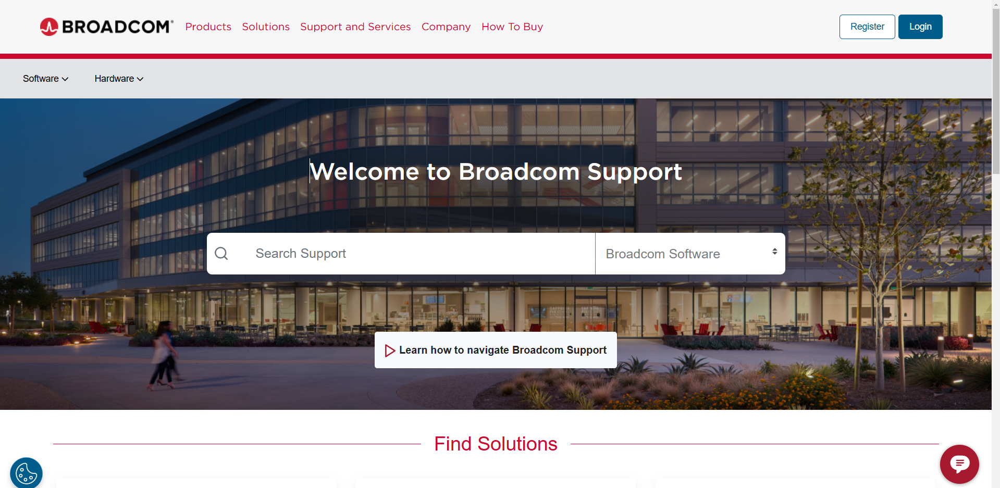

### 2. Log in to Your Broadcom Account
- Click the **Login** button at the top right of the webpage.
- Enter your credentials (username and password) to access the downloads section.
- If you don’t have an account, you may need to **register** for one.

### 3. Select the Version of ESXi You Want to Download
- After logging in, locate the **VMware Cloud Foundation** section.

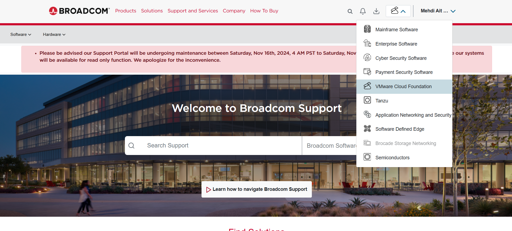

- My Downloads and search VMware vSphere.

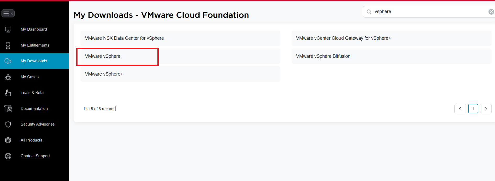

- Choose VMware vSphere - Enterprise and pickup the latest version.
- Select VMware vSphere Hypervisor (ESXi) - View Group.
- Select Custom ISOs.

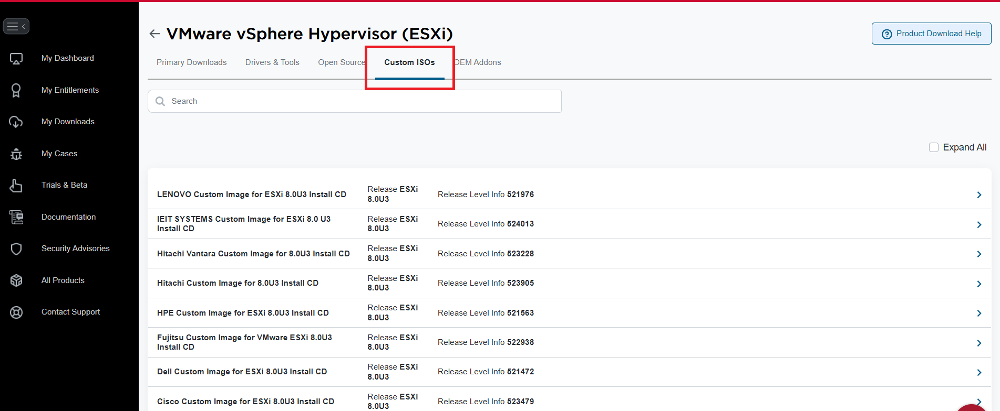

- Download the version of **VMware ESXi** that is compatible with your hardware.

**Note:** As we discussed in the course, if a VM was created using an older version, such as version 7, it will be compatible with higher versions, like version 8. However, the reverse is not true; if a VM was created with a newer version (e.g., version 8), downgrading to an older version will require a conversion process, which may not always be possible.

### 7. Prepare for Installation
- Once you have the ESXi ISO file, you can proceed with creating a bootable USB or prepare a virtual machine (VM) to install ESXi if you are using it as a Type 2 hypervisor.

## Steps for Installing ESXi

### 1. Prepare the Installation Media
- **Physical Server**: Use a tool like **Rufus** or **Etcher** to create a bootable USB drive with the ESXi ISO.
- **Virtual Machine**: Attach the ISO file to the VM as a virtual CD/DVD.
  - **Note**: If you are installing ESXi on top of VMware Workstation, you must select **Custom Installation** when creating the virtual machine. In the configuration options, choose **ESXi** as the guest operating system to ensure compatibility.

### 2. Boot from the Installation Media
- Insert the bootable USB drive into the server or configure the VM to boot from the attached ISO.
- Restart the server/VM and access the **BIOS/UEFI settings** to ensure it boots from the correct media (USB or virtual CD/DVD).
- Save the changes and reboot.

### 3. Start the ESXi Installer
- The system will boot into the ESXi installer.

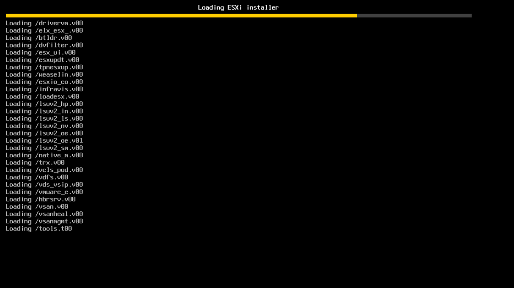
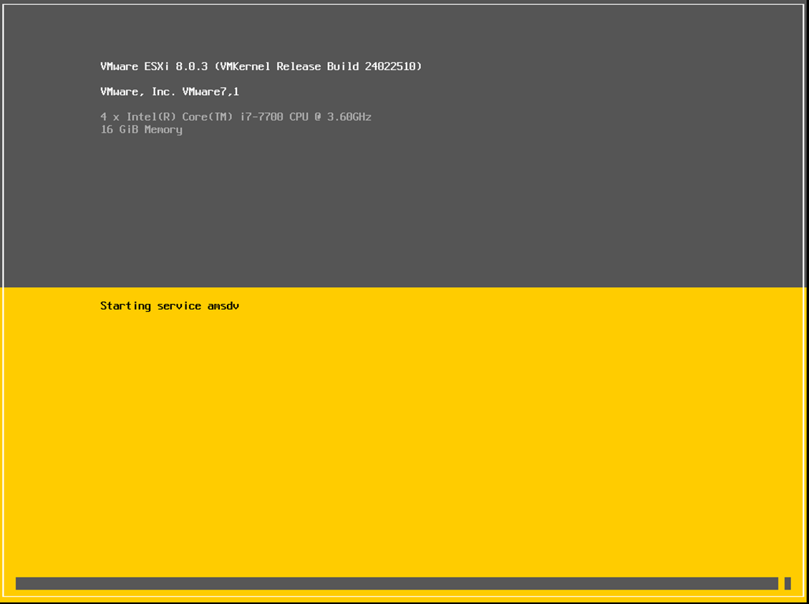

- When prompted, press **Enter** to begin the installation process.

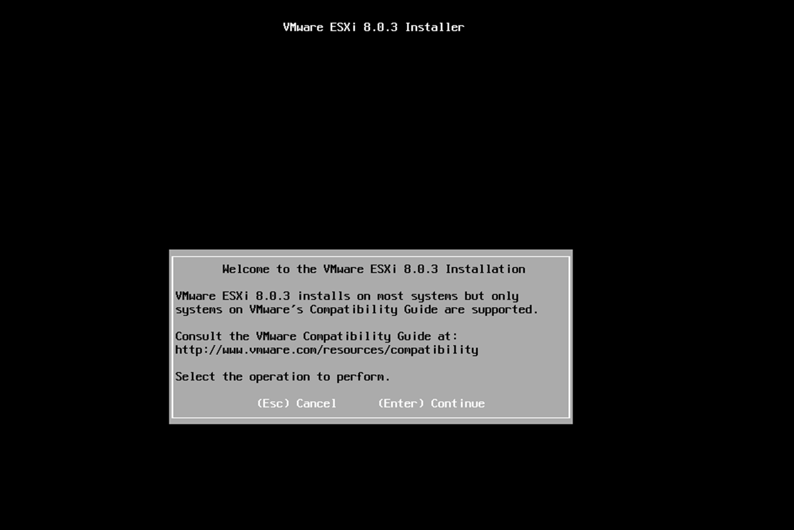

### 4. Accept the End User License Agreement (EULA)
- Read through the EULA and press **F11** to accept and continue.

### 5. Select the Installation Disk
- Choose the disk where ESXi should be installed. 
  - **Note**: Ensure the disk has enough space and is not holding critical data, as it will be formatted.
- Press **Enter** to confirm your selection.

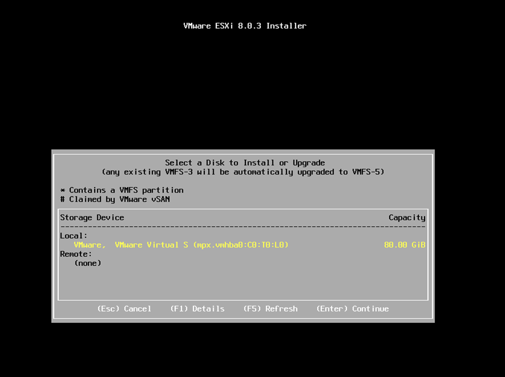

### 6. Choose the Keyboard Layout
- Select your preferred keyboard layout and press **Enter**.

### 7. Set the Root Password
- Enter a secure root password and confirm it. This will be used to manage the ESXi host.
- Press **Enter** to continue.

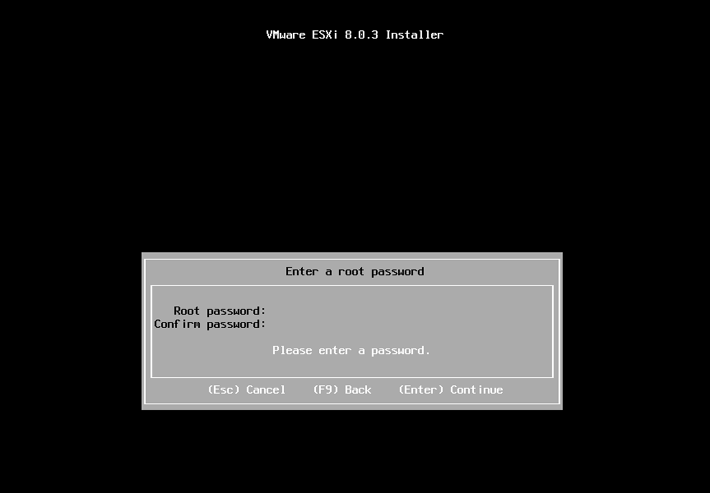

### 8. Confirm the Installation
- A final confirmation screen will appear.
- Press **F11** to start the installation.

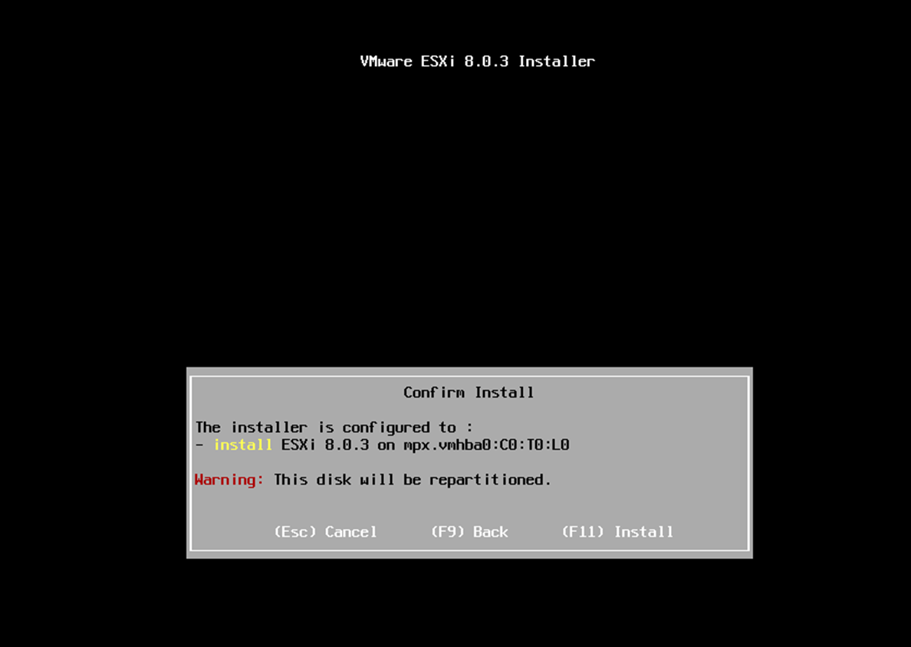

### 9. Complete the Installation
- The installation process will take a few minutes. Once complete, you will see a message indicating that the installation has finished.

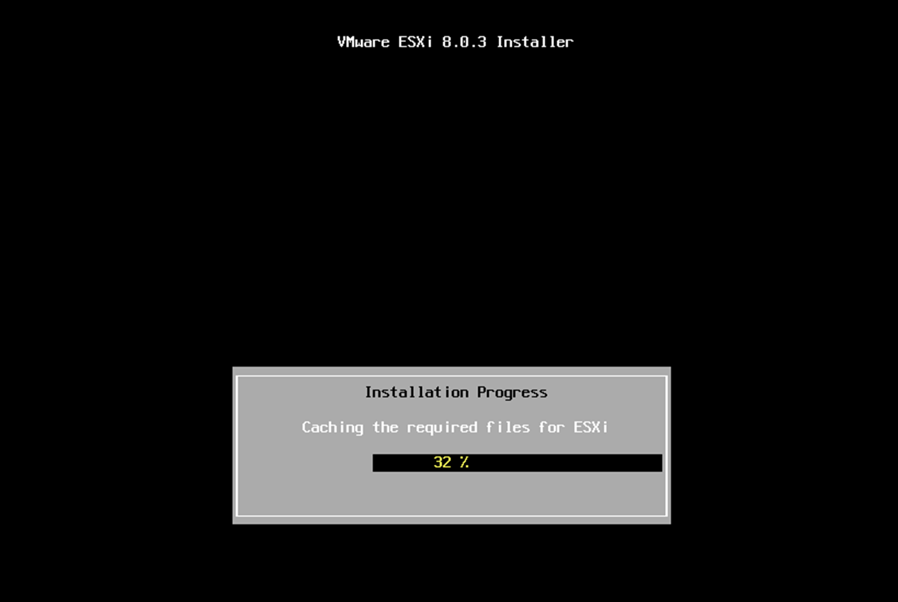

- Remove the installation media and press **Enter** to reboot.

### 10. Initial Configuration After Installation
- After rebooting, you will see the **Direct Console User Interface (DCUI)**.

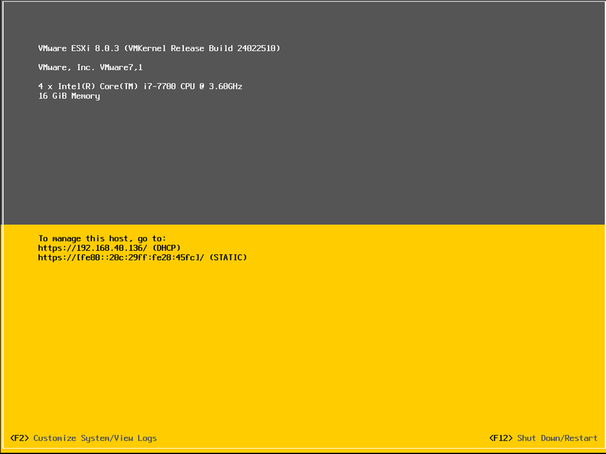

- Press **F2** to log in using the root password you set earlier.

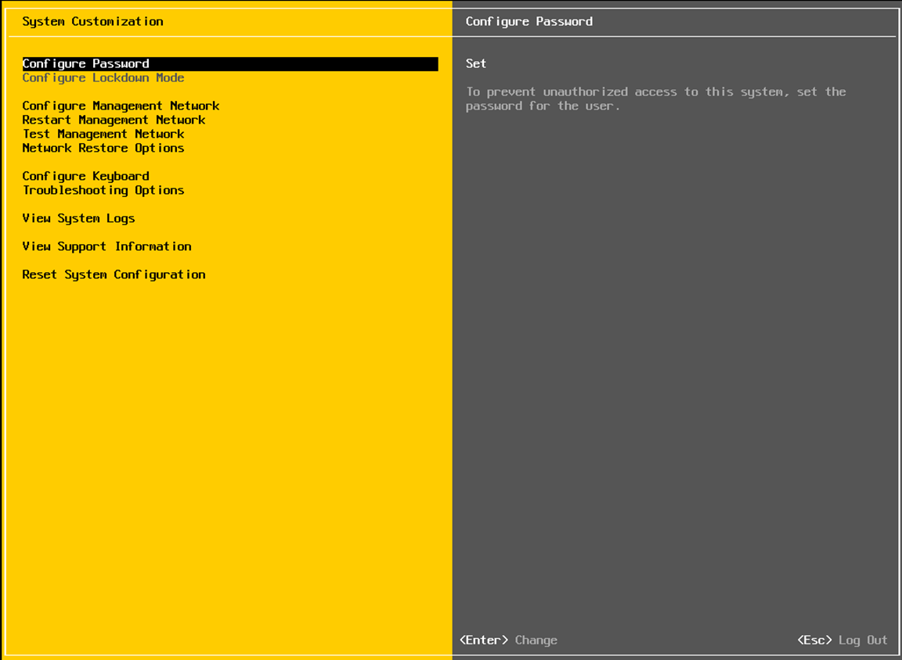

- **Configure Network Settings**:
  - In the **DCUI** menu, navigate to **Configure Management Network**.
  - Select **Network Adapters** to choose which physical network adapter(s) ESXi will use for management traffic.
  - Go to **IPv4 Configuration** to set a static IP address:
    - Select **Set static IPv4 address and network configuration**.
    - Enter the **IP Address**, **Subnet Mask**, and **Default Gateway** as per your network requirements.
  - Select **DNS Configuration** to enter your **Primary DNS** and **Secondary DNS** (if applicable) for network connectivity.
  - Verify your settings and press **Enter** to save.

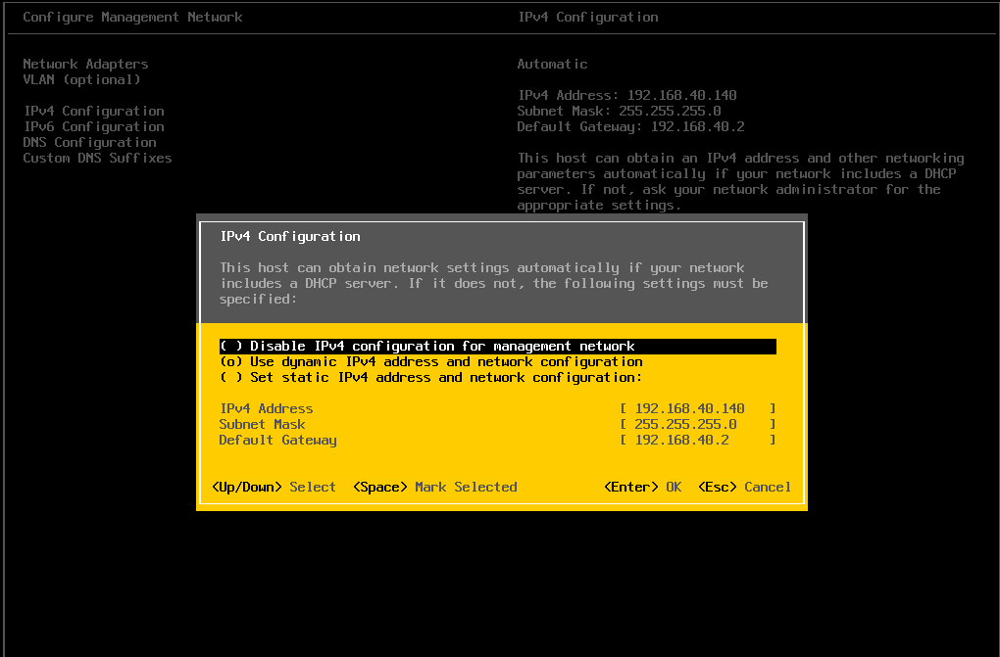

- **Change the Hostname**:
  - In the **DCUI** menu, navigate to **Configure Management Network**.
  - Select **DNS Configuration**.
  - Change the **Hostname** to a descriptive name that matches your naming conventions.
  - Press **Enter** to save the changes.
- Press **Escape** to exit the network configuration menu and apply any changes.

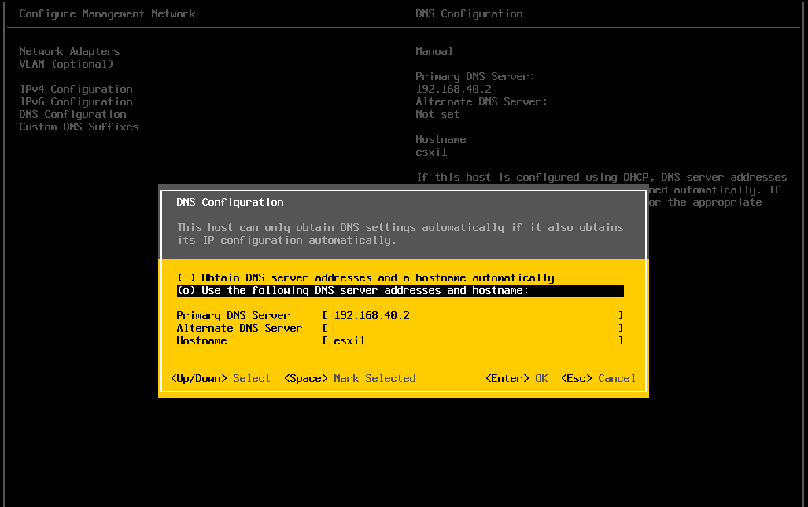

- Press **Escape** to return to the main menu and apply all network settings.
- Rebbot the server.

### 11. Access the ESXi Web Interface
- Use a web browser to navigate to the ESXi host's IP address.
- Log in with the root credentials.
- **Note:** As discussed in the course, if a VM created on ESXi version 7 is used, it will be compatible with higher versions like 8. However, downgrading from version 8 to version 7 requires a conversion process, which may not always be feasible.

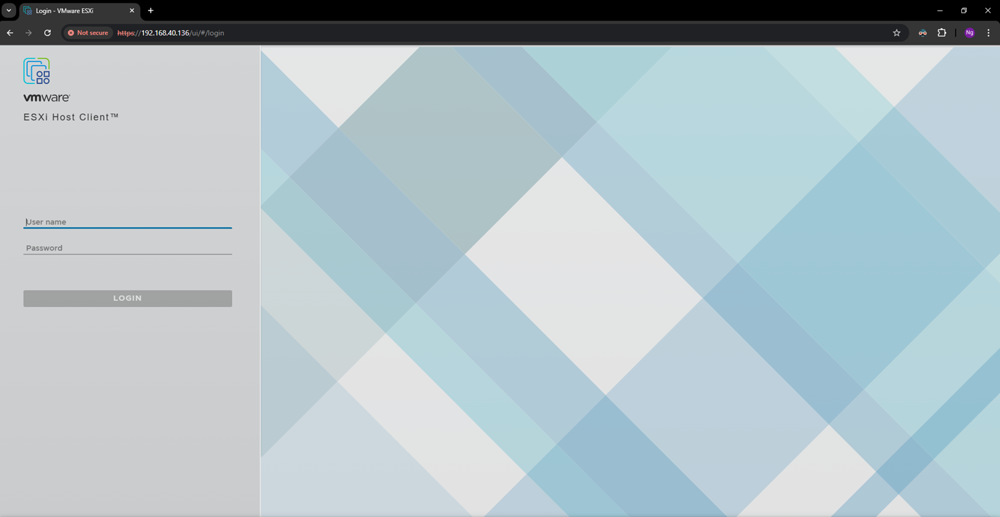
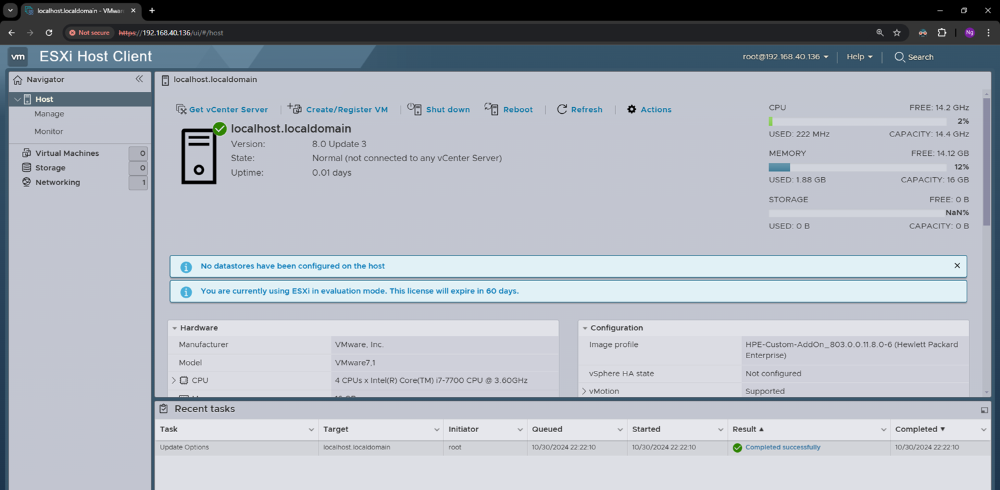