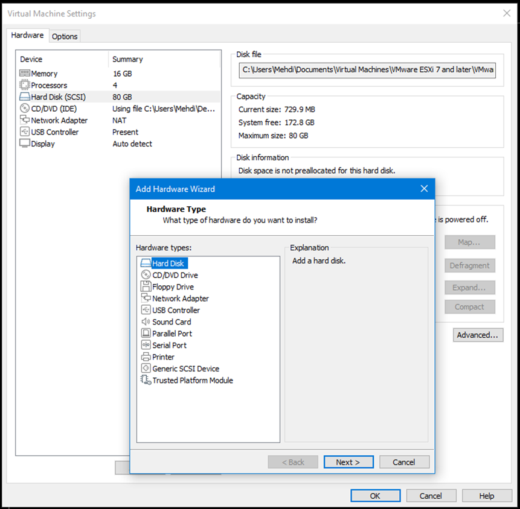
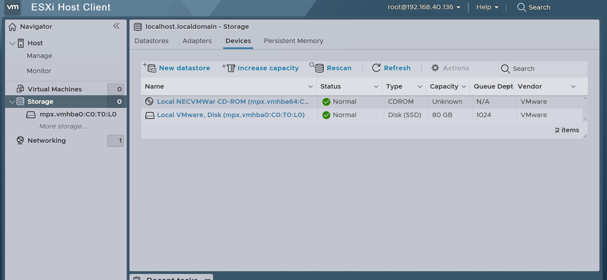
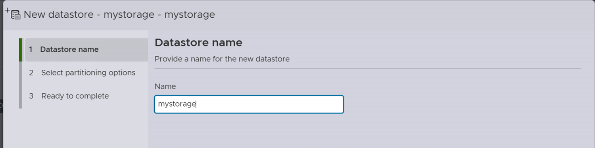
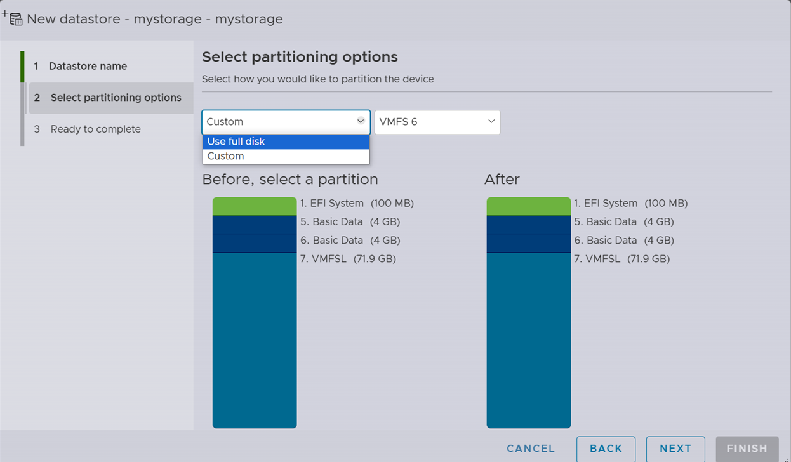
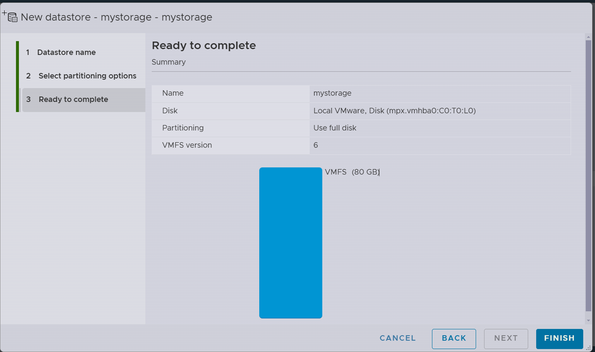

# Lab: Adding and Configuring Storage for ESXi

In this lab, we will simulate the process of adding new storage to our ESXi environment using VMware Workstation and then create a new datastore in vSphere.

## Overview
As we saw in the course, there are many storage solutions available, and in the industry, numerous providers offer NAS and SAN storage, such as **QNAP** **DELL**... While each provider has its own setup process, the general steps remain similar:

1. **Preparing the Environment**: Ensure the environment is ready with controlled conditions, such as room temperature and humidity.
2. **Installing Operating System**: Install the storage OS (if applicable) on the storage device.
3. **Creating a Storage Pool**: Define a storage pool to manage disks and redundancy.
4. **Creating a Volume**: Allocate storage capacity within the storage pool.
5. **(Optional) Creating a Shared Folder**: Configure a shared folder accessible to the network.

After completing these steps, the process for mounting storage to vSphere is typically consistent across setups.

---

## Lab Setup

For this lab, we will simulate adding new storage using VMware Workstation. However, if you are working with ESXi installed on a physical server, you would need to attach a new disk physically to the server.

---

## Steps to Add New Storage to ESXi in VMware Workstation and Create a Datastore in vSphere

### 1. Add a New Virtual Disk in VMware Workstation
- In VMware Workstation, open the **Settings** for your ESXi virtual machine.
- Go to **Add > Hard Disk** to add a new virtual disk.
- Choose **Create a new virtual disk** and specify the size you want for the new storage.
- Complete the wizard to attach the new disk to the ESXi virtual machine.

### 2. Log in to the ESXi Web Client
- Open a web browser and log in to your ESXi host using the IP address, username, and password.

### 3. Navigate to Storage Configuration
- In the ESXi **Navigator** pane, select **Storage** to view existing datastores.

### 4. Create a New Datastore
- Click on **Datastore** > **New Datastore** to start the process of creating a new storage volume.

### 5. Select the Type of Datastore
- Choose **Create new VMFS datastore** and click **Next**.

### 6. Select the Disk
- From the available list of disks, choose the new virtual disk you added in VMware Workstation.
  - **Note**: Be careful to select the correct disk, as this will format the disk for use as a datastore in ESXi.

### 7. Name the Datastore
- Enter a **Name** for your datastore, which will help you easily identify it in your ESXi environment.

### 8. Choose the VMFS Version
- Select the **VMFS version** (typically, VMFS 6 is recommended if available).
- Click **Next** to proceed.

### 9. Allocate Space for the Datastore
- Review the space allocation for your new datastore and adjust if necessary.
- Click **Next** to confirm the settings.

### 10. Complete the Datastore Creation
- Review the configuration settings and click **Finish** to create the new datastore.
- The new datastore should now be visible in the **Storage** section of your ESXi host.

Create a new virtual machine (VM) and configure it to use the newly created datastore.

# Task: Mount a New Disk Using Virtual NAS (TrueNAS)

In this exercise, you will use a **Virtual NAS** (TrueNAS) to create and mount a new disk to your ESXi host. TrueNAS will act as the storage server, and you will configure it to be mounted on your ESXi host or VM.

## Task:

1. **Set up TrueNAS** as a Virtual NAS by installing it on a new VM.
2. **Create a new disk** in TrueNAS and configure it for sharing using the NFS protocol.
3. **Mount the disk** on the ESXi host as a new datastore using NFS.
4. **Use the newly mounted disk** as storage for a new VM in ESXi.

